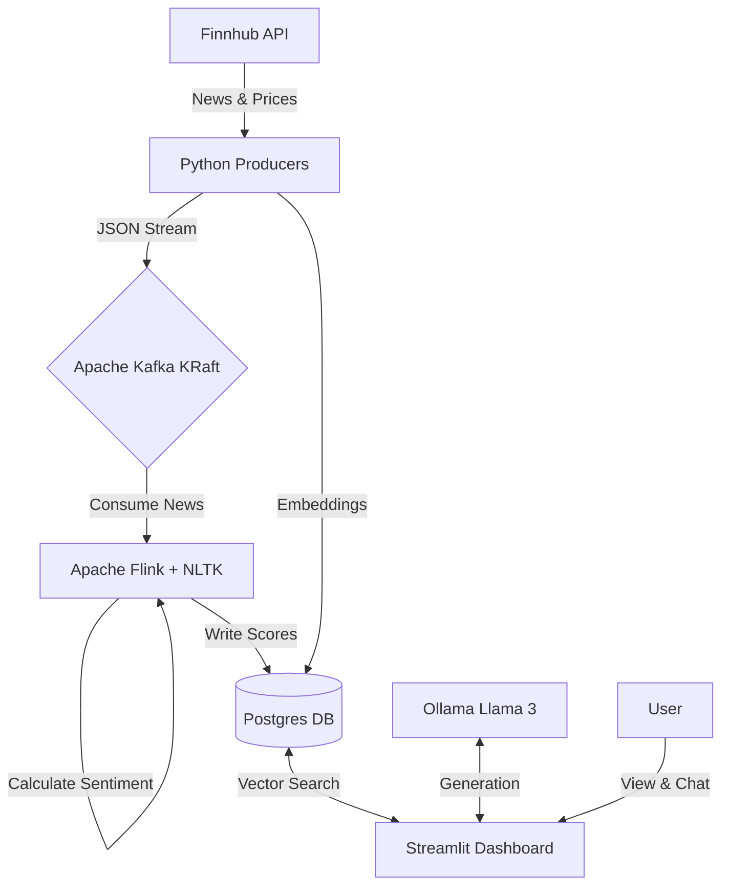

# 🦍 The Market Mood Ring: Real-Time Financial AI & Sentiment Analysis

> **A Data Engineering & GenAI Portfolio Project**
> *Stack: Apache Kafka (KRaft), Apache Flink, PostgreSQL (pgvector), Ollama (Llama 3), Streamlit, Docker.*

> **Status:** Active Development - ETL Pipeline + Local LLM Integration Enabled

---

## 📂 Folder Structure
Verify your project looks exactly like this:

```plaintext
Market_Mood_Ring/
│
├── dashboard/                  # The UI Layer
│   ├── Dockerfile
│   └── app.py                  # Streamlit Dashboard + Chatbot
│
├── flink_jobs/                 # The Processing Layer
│   └── flink_sentiment.py      # PyFlink Job with NLTK
│
├── producer/                   # The Ingestion Layer
│   ├── Dockerfile
│   ├── news_producer.py        # Fetches Finnhub News
│   ├── price_producer.py       # Fetches Prices from Finnhub
│   ├── price_consumer.py       # Consumes prices and writes to DB
│   ├── rag_ingest.py           # Embeds news & saves to pgvector
│   └── tickers.json            # Seed file for stock tickers
│
├── .env                        # API Keys (GitIgnore this!)
├── docker-compose.yaml         # The Infrastructure (Kafka KRaft, Postgres, Flink)
├── Dockerfile.flink            # Custom Flink image with NLTK
├── init.sql                    # SQL to create tables & vector extension
├── requirements.txt            # Python dependencies
├── start_data_pipeline.sh      # Pipeline startup script
├── test_ollama_connection.py   # Diagnostic script
└── README.md                   # This file
```

---

## 📝 Overview
The **Market Mood Ring** is a real-time financial analytics platform designed to detect the "vibe" of the market. By analyzing live news headlines as they break and correlating them with price movements, it provides an AI Analyst that can explain market fluctuations to users in plain English.

### Key Features
* **Real-Time Ingestion:** Streams live stock prices and news headlines via Kafka (KRaft mode).
* **Sentiment Analysis:** Uses Apache Flink with NLTK to score headlines (Positive/Negative) on the fly.
* **Interactive Dashboard:** A Streamlit UI featuring live price charts (72h history) and sentiment scores.
* **Local LLM & RAG:** Integrated with Ollama (Llama 3) running on the Windows host for GPU acceleration, enabling an AI Analyst chatbot.

---

## 🏗️ Architecture



### Core Components
**Ingestion: Python Producers**
- **Source:** Finnhub.io API
- **Transport:** Apache Kafka (KRaft mode - Zookeeper-less)

**Storage: PostgreSQL**
- **Database:** `market_mood`
- **Extensions:** pgvector (for RAG)
- **Access:** `localhost:5432` (via Docker mapping) or container internal `postgres:5432`

**AI/LLM: Ollama (Windows Host)**
- **Model:** llama3
- **Connection:** `http://host.docker.internal:11434` (bridged from WSL)

---

## ⚡ Prerequisites
* **Docker Desktop:** Allocated with at least 8GB RAM.
* **Finnhub API Key:** Obtain a free key from [finnhub.io](https://finnhub.io/).
* **Ollama (Windows):** Installed on Windows for GPU support.
* **System:** WSL2 (Ubuntu) recommended on Windows.

---

## 🚀 Quick Start

### 1. Setup Environment Variables
Copy the template and add your API key:
```bash
cp .env.example .env
nano .env  # Edit with your API key
```

**Required:**
```bash
FINNHUB_API_KEY=your_actual_api_key_here
```

### 2. Start the Data Pipeline
We use a unified script to start the entire infrastructure (Kafka, Postgres, Flink) and all data producers.

```bash
chmod +x start_data_pipeline.sh
./start_data_pipeline.sh
```

This script will:
1. Detect your Windows Host IP.
2. Start all Docker containers.
3. Submit the Flink sentiment analysis job.
4. Verify connections.

### 3. Verify & Monitor
**View Logs:**
```bash
docker-compose logs -f news-producer price-producer
```

**Access Dashboard:**
Open **http://localhost:8502** in your browser.

**Access Flink UI:**
Open **http://localhost:8081** to monitor streaming jobs.

---

## 🧠 AI Analyst Setup (Windows Host)
To enable the AI Analyst to use your Windows GPU:

1.  **Install Ollama** on Windows.
2.  **Pull Llama 3:** `ollama run llama3`
3.  **Allow Network Access:**
    *   Set Environment Variable on Windows: `OLLAMA_HOST=0.0.0.0:11434`
    *   Restart Ollama.
4.  **Firewall:**
    *   Run in PowerShell (Admin): `New-NetFirewallRule -DisplayName "Ollama Allow" -Direction Inbound -LocalPort 11434 -Protocol TCP -Action Allow`

---

## ⚠️ Troubleshooting
*   **"NoBrokersAvailable":** The pipeline script handles startup order, but if this occurs, run `docker-compose down` and retry the script.
*   **"Cannot reach Ollama":** Ensure the Windows Firewall rule is active and `OLLAMA_HOST` is set.
*   **Database Access:** If `localhost:5432` is inaccessible from Windows, ensure Docker Desktop port forwarding is active or connect via the container IP.
