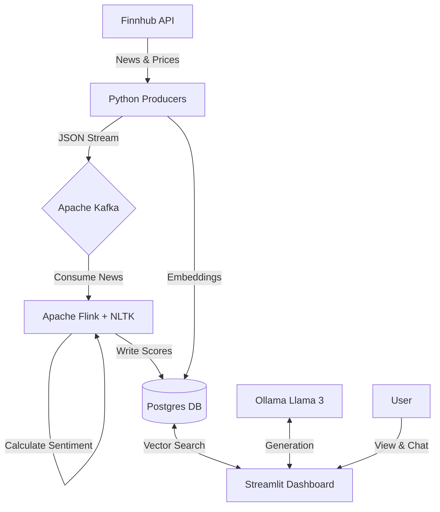

# 🦍 The Market Mood Ring: Real-Time Financial AI & Sentiment Analysis

> **A Data Engineering & GenAI Portfolio Project**
> *Stack: Apache Kafka, Apache Flink, PostgreSQL (pgvector), Ollama (Llama 3), Streamlit, Docker.*
> 
> **Current Phase: Combined Development Phase (Phase 1 + Phase 2 Ollama)**  
> **Status:** Active Development - ETL Pipeline + Local LLM Integration Enabled

---

## 📂 Folder Structure
Verify your project looks exactly like this:

```plaintext
Market_Mood_Ring/
│
├── dashboard/                  # The UI Layer
│   ├── Dockerfile
│   └── app.py                  # Streamlit Dashboard + Chatbot
│
├── flink_jobs/                 # The Processing Layer
│   └── flink_sentiment.py      # PyFlink Job with NLTK
│
├── producer/                   # The Ingestion Layer
│   ├── Dockerfile
│   ├── news_producer.py        # Fetches Finnhub News
│   ├── price_producer.py       # Fetches Prices from Finnhub
│   ├── price_consumer.py       # Consumes prices and writes to DB
│   ├── rag_ingest.py           # Embeds news & saves to pgvector (Phase 2)
│   └── tickers.json            # Seed file for stock tickers
│
├── docs/                       # Documentation
│   ├── architecture/           # Architecture diagrams
│   ├── setup/                  # Setup guides
│   ├── troubleshooting/       # Troubleshooting guides
│   ├── technical/              # Technical deep-dives
│   └── phases/                 # Phase planning
│
├── .env                        # API Keys (GitIgnore this!)
├── docker-compose.yaml         # The Infrastructure
├── Dockerfile.flink            # Custom Flink image with NLTK
├── init.sql                    # SQL to create tables & vector extension
├── requirements.txt            # Python dependencies (Phase 1)
├── requirements-phase2.txt     # Additional dependencies (Phase 2)
├── setup.sh                    # Automated setup script
├── start_data_pipeline.sh      # Pipeline startup script
└── README.md                   # This file
```

---

## 📝 Overview
The **Market Mood Ring** is a real-time financial analytics platform designed to detect the "vibe" of the market. By analyzing live news headlines as they break and correlating them with price movements, it provides an AI Analyst that can explain market fluctuations to users in plain English.

> **Note:** This platform tracks **regular US stocks** (NYSE, NASDAQ) from Finnhub API - **NOT cryptocurrency**. Default configuration includes 25+ stocks across Technology, Finance, Healthcare, Consumer, and Energy sectors.

### Key Features

**Phase 1 (Active):**
* **Real-Time Ingestion:** Streams live stock prices and news headlines via Kafka.
* **Sentiment Analysis:** Uses Apache Flink with NLTK to score headlines (Positive/Negative) on the fly.
* **Interactive Dashboard:** A Streamlit UI featuring live price charts and sentiment score tables.

**Phase 2/3 - Ollama Integration (Active):**
* **Local LLM:** Ollama server running Llama 3 locally (Enabled).
* **AI Analyst:** Chatbot enabled in Dashboard using local Ollama model.
* **RAG Pipeline:** Ready for embedding generation and vector search.

---

## 🏗️ Architecture



### Core Components

**Ingestion: Python Producers (Custom Scripts)**
- **Source:** Finnhub.io API (Free Tier) - Regular US stocks (NOT crypto)
- **Transport:** Apache Kafka
- **Topics:** 
  - `stock_news` (JSON, retention 24h)
  - `stock_prices` (JSON, retention 24h)
- **Default Stocks:** 30 optimized tickers including Magnificent Seven (AAPL, MSFT, GOOGL, AMZN, META, NVDA, TSLA), financials (JPM, BAC, GS, V, MA), consumer (DIS, NKE, SBUX, MCD), and more
- **Ticker Management:** Tickers are managed via `producer/tickers.json` seed file (easy to modify)
- **Customization:** 
  - Edit `producer/tickers.json` to add/remove tickers (recommended)
  - Or set `STOCK_SYMBOLS` environment variable (comma-separated) for quick overrides
- **Rate Limits:** News producer auto-adjusts cycle time to respect Finnhub Free Tier (60 calls/minute)

**Stream Processing: Apache Flink (v1.17, PyFlink)**
- **Logic:** Stateless mapping using NLTK Vader
- **Input:** Kafka `stock_news` topic
- **Output:** Postgres `sentiment_log` table

**Storage: PostgreSQL (v14)**
- **Database:** `market_mood`
- **User:** `market_user`
- **Password:** `market_password`
- **Extensions:** pgvector (for Phase 2/3 RAG)
- **Port:** 5432

**AI/LLM: Ollama (Local - Active)**
- **Model:** llama3 (Runs on Windows Host GPU)
- **Service:** REST API at `http://host.docker.internal:11434`
- **Status:** Enabled (Combined Phase) - Using Windows Host
- **Config:** Requires `OLLAMA_HOST=0.0.0.0:11434` on Windows

**UI: Streamlit**
- **Features:** Real-time charts + Chat interface
- **Port:** 8502 (mapped from container port 8501)

---

## ⚡ Prerequisites
* **Docker Desktop:** Allocated with at least 8GB–10GB RAM.
* **Finnhub API Key:** Obtain a free key from [finnhub.io](https://finnhub.io/).
* **System:** Linux or macOS is preferred; Windows users should use WSL2.

---

## 🚀 Quick Start

### 1. Setup Python Environment (UV)

**Install UV** (if not already installed):
```bash
curl -LsSf https://astral.sh/uv/install.sh | sh
```

**Create virtual environment and install dependencies:**
```bash
# Create venv
uv venv

# Activate venv
source .venv/bin/activate  # Linux/Mac
# or
.venv\Scripts\activate     # Windows

# Install packages
uv pip install -r requirements.txt
```

**Or use the setup script:**
```bash
chmod +x setup.sh
./setup.sh
```

### 2. Setup Environment Variables

**Copy the template and add your API key:**
```bash
cp .env.example .env
nano .env  # Edit with your API key
```

**Minimum required for Phase 1:**
```bash
FINNHUB_API_KEY=your_actual_api_key_here
```

**Optional:**
```bash
# Customize stock symbols (comma-separated)
STOCK_SYMBOLS=AAPL,MSFT,TSLA,GOOGL,AMZN
```

> **Note:** 
> - The system tracks regular US stocks (NOT crypto). Default includes diverse sectors: Technology, Finance, Healthcare, Consumer, and Energy.
> - For Phase 2 LLM integration, see `.env.example` for LLM API key configuration.
> - See `docs/setup/ENV_FILE_GUIDE.md` for complete environment variable documentation.

### 3. Launch Infrastructure (Docker)

Start the entire stack (Kafka, Flink, Postgres, Streamlit):
```bash
docker-compose up -d --build
```
> **Note:** The initial build may take several minutes as it downloads large database images.

### 4. Start the Data Pipelines (Automated)
Run the automated pipeline script to start all producers (News, Price, Consumer, RAG Ingest) in the background:

```bash
./start_data_pipeline.sh
```

**Or verify individual services:**
```bash
docker-compose --profile producers ps
```

**To view logs:**
```bash
docker-compose logs -f news-producer price-producer
```

### 5. Submit Flink Job
Submit the sentiment analysis job to the Flink cluster:
```bash
docker exec -it market_jobmanager ./bin/flink run -py /opt/flink/usrlib/flink_sentiment.py
```

**Verify job is running:**
```bash
docker exec market_jobmanager ./bin/flink list
```

You should see the job status as "RUNNING".

---

## 🖥️ Usage

| Service | URL | Credentials |
| :--- | :--- | :--- |
| **Streamlit Dashboard** | `http://localhost:8502` | N/A |
| **Flink Dashboard** | `http://localhost:8081` | N/A |
| **Postgres (External)** | `localhost:5432` | User: `market_user` / Pass: `market_password` / DB: `market_mood` |
| **Ollama API (Phase 3)** | `http://localhost:11434` | N/A |

---

## 📊 Phase 1 Features

### Live Dashboard
Navigate to the Streamlit dashboard at `http://localhost:8502`. You can:
- View real-time price charts for any tracked stock
- See sentiment scores for recent news headlines
- Filter by symbol and time range

### Phase 2/3 Preview (Future)
**AI Analyst Chat** will be available in Phase 2 (LLM) or Phase 3 (Ollama):
- Navigate to **"💬 AI Analyst"** from the sidebar
- Ask questions like: *"What is the latest news on Tesla?"*
- The system will retrieve relevant news vectors and use LLM to summarize market sentiment

---

## 📊 Data Dictionary (Database Schemas)

### Table 1: `price_log` (Time Series)
| Column | Type | Description |
| :--- | :--- | :--- |
| `symbol` | VARCHAR | Stock ticker (e.g., 'AAPL') |
| `price` | DECIMAL | Current price (e.g., 150.25) |
| `timestamp` | TIMESTAMP | UTC time |

### Table 2: `sentiment_log` (Enriched Data)
| Column | Type | Description |
| :--- | :--- | :--- |
| `symbol` | VARCHAR | Stock ticker |
| `headline` | TEXT | News headline |
| `sentiment_score` | FLOAT | -1.0 to 1.0 (Output of Flink+NLTK) |

### Table 3: `financial_knowledge` (Vector Store)
| Column | Type | Description |
| :--- | :--- | :--- |
| `content` | TEXT | Raw news summary |
| `embedding` | VECTOR[384] | Generated by all-MiniLM-L6-v2 |
| `symbol` | VARCHAR | Stock ticker (optional) |

---

## ⚠️ Troubleshooting
* **"Exit Code 137":** This usually indicates a memory overflow. Increase the Docker Desktop memory limit to at least 8GB in Settings > Resources.
* **Kafka Connectivity:** If producers fail to connect, ensure the Kafka broker is healthy in the Docker logs using `docker-compose logs kafka`.
* **Database Connection:** Ensure you're connecting to the `market_mood` database with user `market_user` and password `market_password`.
* **Flink Job Submission:** The Flink job path should be `/opt/flink/usrlib/flink_sentiment.py` when submitting from the `market_jobmanager` container.
* **No Data in Dashboard:** 
  - Ensure all producers are running (`news_producer.py`, `price_producer.py`, `price_consumer.py`)
  - Verify Flink job is submitted and running: `docker exec market_jobmanager ./bin/flink list`
  - Check database has data: `docker exec market_postgres psql -U market_user -d market_mood -c "SELECT COUNT(*) FROM price_log;"`
* **Python Command Not Found (Flink):** Rebuild Flink containers: `docker-compose build jobmanager taskmanager`
* **Kafka Connector Not Found:** Ensure Flink containers are rebuilt with connector JARs (see `Dockerfile.flink`)

## 🔮 Phase 2 & 3: LLM and Ollama Integration (Future)

### Phase 2: LLM Integration
When ready for Phase 2 development:
1. Uncomment `financial_knowledge` table creation in `init.sql`
2. Uncomment RAG pipeline code in `dashboard/app.py`
3. Add LLM API client (OpenAI, Anthropic, etc.)
4. Start RAG ingestion: `docker-compose run --rm producer python rag_ingest.py`

### Phase 3: Ollama Integration (Windows Host)
1. **Windows Setup:**
   - Set Environment Variable: `OLLAMA_HOST=0.0.0.0:11434`
   - Restart Ollama on Windows
   - Pull Model: `ollama run llama3` (in Windows Command Prompt)

2. **Docker Setup:**
   - `docker-compose.yaml` configured with `extra_hosts: "host.docker.internal:host-gateway"`
   - Dashboard connects to `http://host.docker.internal:11434`

3. **Verify:**
   - Dashboard should connect to your Windows Ollama instance for GPU acceleration.

See `docs/phases/PHASE_PLANNING.md` for detailed phase information.

---

## 🧠 AI System Prompt Specification

The Streamlit dashboard (`dashboard/app.py`) uses the following system prompt for the AI Analyst:

```
You are a Real-Time Financial Sentiment Analyst.
Your goal is to explain market movements to a user based ONLY on the news context provided.

CONTEXT FROM LIVE DATABASE:
{context_text}

USER QUESTION:
{prompt}

INSTRUCTIONS:
1. Analyze the 'CONTEXT' provided above. It contains recent news headlines and sentiment scores.
2. If the user asks "Why is [Stock] moving?", look for positive or negative events in the context.
3. If the context has no relevant news, admit it. Say: "I don't see any recent news for [Stock] in my live database."
4. Be concise (under 3 sentences).
5. Explain financial jargon simply (ELI5 style).
6. End with a "Vibe Check" summary (e.g., "Overall Vibe: 🐻 Bearish due to regulatory fears").
```

> **Note:** This prompt should be implemented in the `full_prompt` variable within `dashboard/app.py`.