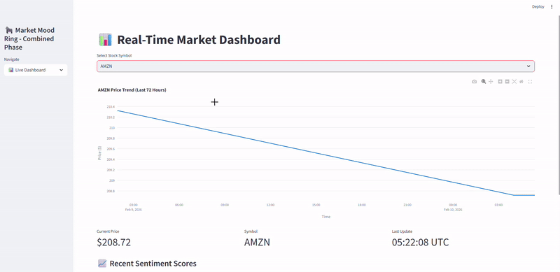
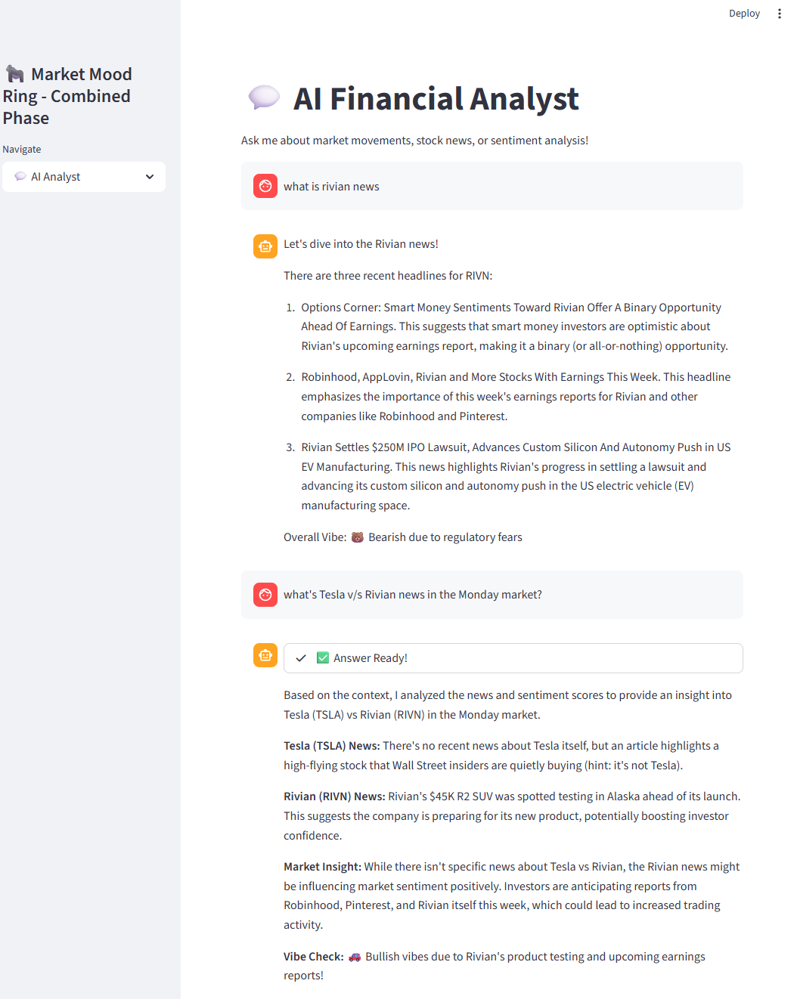
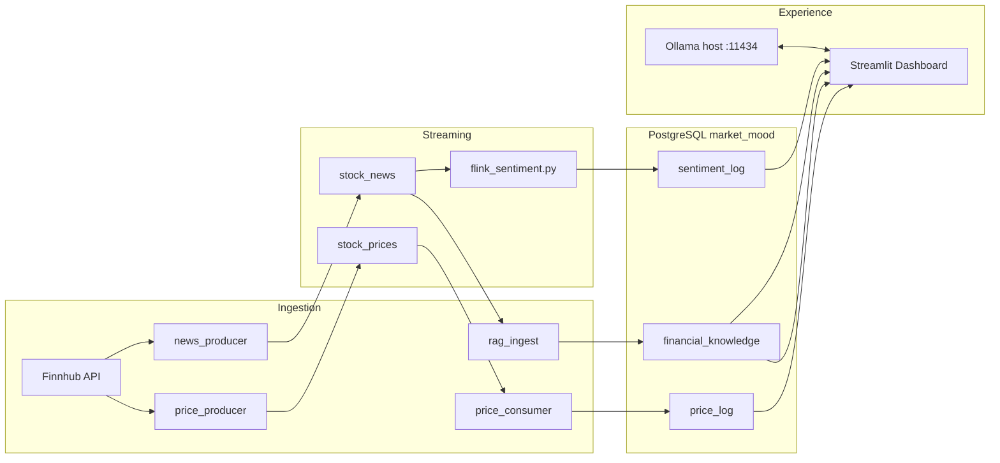
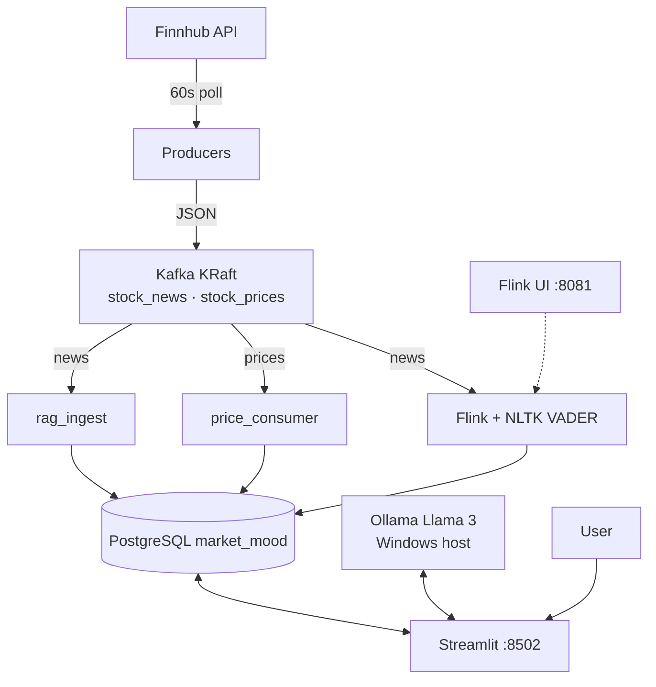

# 🦍 The Market Mood Ring: Real-Time Financial AI & Sentiment Analysis

> **A Data Engineering & GenAI Portfolio Project**
> *Stack: Apache Kafka (KRaft), Apache Flink, PostgreSQL (pgvector), Ollama (Llama 3), Streamlit, Docker.*

> **Status:** ✅ Production Ready - Full ETL Pipeline + Local LLM Integration Operational

<div align="center">

[](https://vgandhi1.github.io/MARKET_MOOD_RING/)
[](manage/presentation.html)

📊 **[Live Presentation](https://vgandhi1.github.io/MARKET_MOOD_RING/)** · [Static slides](manage/presentation.html) · [Leadership deck (Markdown)](manage/leadership-review-deck.md)

*Pages: **Settings → Pages → Deploy from branch → `gh-pages` / (root)** — not `main`; then run **Deploy GitHub Pages** workflow ([.github/workflows/pages.yml](.github/workflows/pages.yml)).*

</div>

---

## 📂 Folder Structure
Verify your project looks exactly like this:

```plaintext
Market_Mood_Ring/
│
├── dashboard/                  # The UI Layer
│   ├── Dockerfile
│   └── app.py                  # Streamlit Dashboard + Chatbot
│
├── flink_jobs/                 # The Processing Layer
│   └── flink_sentiment.py      # PyFlink Job with NLTK
│
├── producer/                   # The Ingestion Layer
│   ├── Dockerfile
│   ├── news_producer.py        # Fetches Finnhub News
│   ├── price_producer.py       # Fetches Prices from Finnhub
│   ├── price_consumer.py       # Consumes prices and writes to DB
│   ├── rag_ingest.py           # Embeds news & saves to pgvector
│   └── tickers.json            # Seed file for stock tickers
│
├── .env                        # API Keys (GitIgnore this!)
├── docker-compose.yaml         # The Infrastructure (Kafka KRaft, Postgres, Flink)
├── Dockerfile.flink            # Custom Flink image with NLTK
├── init.sql                    # SQL to create tables & vector extension
├── manage/                     # Leadership materials
│   ├── presentation.html       # Static slide deck (GitHub Pages)
│   └── leadership-review-deck.md
├── requirements.txt            # Python dependencies
├── start_data_pipeline.sh      # Pipeline startup script
├── test_ollama_connection.py   # Diagnostic script
└── README.md                   # This file
```

---

## 📝 Overview
The **Market Mood Ring** is a real-time financial analytics platform that scores market **mood** from live news and prices. By analyzing headlines as they break and correlating them with price movements, it provides an AI Analyst that explains market fluctuations in plain English.

### Key Features
* **Real-Time Ingestion:** Streams live stock prices and news headlines via Kafka (KRaft mode).
* **Sentiment Analysis:** Uses Apache Flink with NLTK to score headlines (Positive/Negative) on the fly.
* **Interactive Dashboard:** A Streamlit UI featuring live price charts (72h history) and sentiment scores.
* **Local LLM & RAG:** Integrated with Ollama (Llama 3) running on the Windows host for GPU acceleration, enabling an AI Analyst chatbot.

---

## 🎬 Demo & Screenshots

### Leadership presentation (GitHub Pages)

Use the **[live slide deck](https://vgandhi1.github.io/MARKET_MOOD_RING/)** for stakeholder walkthroughs (architecture, business value, roadmap). Source: [`manage/presentation.html`](manage/presentation.html). Deploys on push when [Pages](https://github.com/vgandhi1/MARKET_MOOD_RING/settings/pages) uses branch **`gh-pages`** (root), not `main`.

### Live Dashboard in Action


*The dashboard updates in real-time as news flows through the Kafka → Flink → PostgreSQL pipeline, displaying sentiment scores and price movements.*

### AI Analyst Chat Interface


*Ask questions about market movements and get AI-powered insights based on recent news and sentiment data using RAG (Retrieval Augmented Generation).*

### What You'll See
- 📊 **Live Sentiment Scores**: Real-time NLTK-based sentiment analysis on news headlines
- 📈 **Price Charts**: 72-hour historical price data with trend visualization
- 🤖 **AI Analyst**: Chat with Llama 3 about market conditions, powered by pgvector RAG
- 🔄 **Data Freshness**: News and prices update every 60 seconds from Finnhub API
- 🌊 **Stream Processing**: Watch Flink jobs process messages in real-time via Flink UI (port 8081)

---

## 🏗️ Architecture

### Layered system view

| Layer | Components | Responsibility |
|-------|------------|----------------|
| **Sources** | Finnhub REST API | News headlines and stock quotes (60s poll) |
| **Ingestion** | `news_producer`, `price_producer`, `price_consumer`, `rag_ingest` | Publish to Kafka; persist prices and embeddings |
| **Streaming** | Kafka KRaft (`stock_news`, `stock_prices`) | Durable, ordered event bus (no Zookeeper) |
| **Processing** | Flink + `flink_sentiment.py` (NLTK VADER UDF) | Real-time sentiment scores → `sentiment_log` |
| **Storage** | PostgreSQL `market_mood` + pgvector | Time series, sentiment, vector RAG store |
| **Intelligence** | Ollama Llama 3 on Windows host | Grounded answers via retrieval + generation |
| **Experience** | Streamlit `:8502`, leadership slides | Live dashboard and stakeholder demo |

### End-to-end data flow


```mermaid
flowchart LR
    subgraph ingest [Ingestion]
        FH[Finnhub API]
        NP[news_producer]
        PP[price_producer]
        PC[price_consumer]
        RI[rag_ingest]
    end

    subgraph stream [Streaming]
        K1[stock_news]
        K2[stock_prices]
        FL[flink_sentiment.py]
    end

    subgraph store [PostgreSQL market_mood]
        SL[sentiment_log]
        PL[price_log]
        FK[financial_knowledge]
    end

    FH --> NP & PP
    NP --> K1 --> FL --> SL
    PP --> K2 --> PC --> PL
    K1 --> RI --> FK

    subgraph ui [Experience]
        ST[Streamlit Dashboard]
        OL[Ollama host :11434]
    end

    SL & PL & FK --> ST
    FK --> ST
    OL <--> ST
```

### System diagram (deployment)


```mermaid
graph TD
    API[Finnhub API] -->|60s poll| PROD[Producers]
    PROD -->|JSON| KAFKA[Kafka KRaft<br/>stock_news · stock_prices]
    KAFKA -->|news| FLINK[Flink + NLTK VADER]
    FLINK --> DB[(PostgreSQL market_mood)]
    KAFKA -->|prices| PC[price_consumer]
    PC --> DB
    KAFKA -->|news| RAG[rag_ingest]
    RAG --> DB
    DB <--> DASH[Streamlit :8502]
    OLLAMA[Ollama Llama 3<br/>Windows host] <--> DASH
    USER[User] --> DASH
    FLINK_UI[Flink UI :8081] -.-> FLINK
```

### Core Components

#### 1. **Ingestion: Python Producers**
- **Source:** Finnhub.io API (free tier)
- **Transport:** Apache Kafka (KRaft mode - Zookeeper-less)
- **Frequency:** 60-second polling cycles
- **Components:**
  - `news_producer.py` → Publishes to `stock_news` topic
  - `price_producer.py` → Publishes to `stock_prices` topic
  - `price_consumer.py` → Consumes prices and writes to PostgreSQL
  - `rag_ingest.py` → Creates embeddings for vector search

#### 2. **Stream Processing: Apache Flink**
- **Engine:** Apache Flink 1.17+ with PyFlink API
- **Job:** `flink_sentiment.py`
- **Function:** Real-time sentiment analysis using NLTK's VADER (Valence Aware Dictionary and sEntiment Reasoner)
- **Input:** Kafka `stock_news` topic (JSON messages)
- **Output:** PostgreSQL `sentiment_log` table
- **UDF:** Python User-Defined Function for sentiment calculation
- **Startup Mode:** `latest-offset` (processes new messages only)
- **Deployment:** JobManager + TaskManager architecture

#### 3. **Storage: PostgreSQL with pgvector**
- **Database:** `market_mood`
- **Extensions:** pgvector (for RAG vector similarity search)
- **Tables:**
  - `sentiment_log` - Sentiment scores with timestamps
  - `price_log` - Historical stock prices
  - `financial_knowledge` - News embeddings for RAG
- **Access:** `localhost:5432` (from host) or `postgres:5432` (from containers)
- **Credentials:** `market_user` / `market_password`

#### 4. **AI/LLM: Ollama (Windows Host)**
- **Model:** llama3 (8B parameters)
- **Deployment:** Windows host for GPU acceleration
- **Connection:** `http://host.docker.internal:11434` (bridged from WSL Docker)
- **Purpose:** Powers the AI Analyst chatbot with RAG capabilities
- **Requirements:** 
  - Environment variable: `OLLAMA_HOST=0.0.0.0:11434`
  - Firewall rule: Allow TCP port 11434
  - Windows host IP auto-detected by `start_data_pipeline.sh`

#### 5. **Presentation: Streamlit Dashboard**
- **Framework:** Streamlit (Python web framework)
- **Port:** 8502
- **Features:**
  - Real-time sentiment score visualization
  - 72-hour price history charts
  - AI Analyst chatbot interface
  - Auto-refresh capabilities
- **Data Sources:** PostgreSQL queries + Ollama API calls

### Data Flow

1. **News Ingestion** (60s cycle):
   ```
   Finnhub API → news_producer.py → Kafka (stock_news) → Flink → PostgreSQL (sentiment_log)
                                                        ↘
                                                      rag_ingest.py → PostgreSQL (financial_knowledge)
   ```

2. **Price Ingestion** (60s cycle):
   ```
   Finnhub API → price_producer.py → Kafka (stock_prices) → price_consumer.py → PostgreSQL (price_log)
   ```

3. **User Query** (real-time):
   ```
   User → Streamlit Dashboard → PostgreSQL (vector search) + Ollama (generation) → Response
   ```

### Network Architecture

```
┌─────────────────────────────────────────────────────────────┐
│ Windows Host (WSL2)                                         │
│                                                             │
│  ┌────────────────┐        ┌──────────────────┐           │
│  │ Ollama Service │◄───────┤ Firewall Rule    │           │
│  │ Port 11434     │        │ TCP Allow        │           │
│  │ GPU Enabled    │        └──────────────────┘           │
│  └────────┬───────┘                                        │
│           │                                                │
│           │ OLLAMA_HOST=0.0.0.0:11434                      │
└───────────┼────────────────────────────────────────────────┘
            │
            │ host.docker.internal (auto-detected IP)
            │
┌───────────▼────────────────────────────────────────────────┐
│ Docker Network: market_network (bridge)                    │
│                                                             │
│  ┌──────────┐  ┌──────────┐  ┌──────────┐  ┌───────────┐ │
│  │ Kafka    │  │ Postgres │  │ Flink    │  │ Dashboard │ │
│  │ :29092   │  │ :5432    │  │ :8081    │  │ :8502     │ │
│  └──────────┘  └──────────┘  └──────────┘  └───────────┘ │
│                                                             │
│  ┌──────────────────────────────────────────────────────┐ │
│  │ Producers (--profile producers)                      │ │
│  │ • news_producer  • price_producer                    │ │
│  │ • price_consumer • rag_ingest                        │ │
│  └──────────────────────────────────────────────────────┘ │
└─────────────────────────────────────────────────────────────┘
```

### Key Architectural Decisions

1. **KRaft Mode Kafka**: No Zookeeper dependency, simpler deployment
2. **PyFlink UDF**: Python sentiment analysis integrated directly in Flink stream
3. **Docker Profiles**: Separate infrastructure from data producers for flexible control
4. **Host-based LLM**: Ollama runs on Windows host for GPU access (not in container)
5. **Latest-Offset**: Flink job processes only new messages to avoid reprocessing
6. **60-Second Polling**: Balances API rate limits with data freshness
7. **pgvector Extension**: Enables efficient similarity search for RAG without external vector DB

---

## ⚡ Prerequisites
* **Docker Desktop:** Allocated with at least 8GB RAM.
* **Finnhub API Key:** Obtain a free key from [finnhub.io](https://finnhub.io/).
* **Ollama (Windows):** Installed on Windows for GPU support.
* **System:** WSL2 (Ubuntu) recommended on Windows.

---

## 🚀 Quick Start

### 1. Setup Environment Variables
Copy the template and add your API key:
```bash
cp .env.example .env
nano .env  # Edit with your API key
```

**Required:**
```bash
FINNHUB_API_KEY=your_actual_api_key_here
```

### 2. Start the Data Pipeline
We use a unified script to start the entire infrastructure (Kafka, Postgres, Flink) and all data producers.

```bash
chmod +x start_data_pipeline.sh
./start_data_pipeline.sh
```

This script will:
1. Detect your Windows Host IP.
2. Start all Docker containers.
3. Submit the Flink sentiment analysis job.
4. Verify connections.

### 3. Verify & Monitor
**View Logs:**
```bash
docker-compose logs -f news-producer price-producer
```

**Access Dashboard:**
Open **http://localhost:8502** in your browser.

**Access Flink UI:**
Open **http://localhost:8081** to monitor streaming jobs.

---

## 🧠 AI Analyst Setup (Windows Host)
To enable the AI Analyst to use your Windows GPU:

1.  **Install Ollama** on Windows.
2.  **Pull Llama 3:** `ollama run llama3`
3.  **Allow Network Access:**
    *   Set Environment Variable on Windows: `OLLAMA_HOST=0.0.0.0:11434`
    *   Restart Ollama.
4.  **Firewall:**
    *   Run in PowerShell (Admin): `New-NetFirewallRule -DisplayName "Ollama Allow" -Direction Inbound -LocalPort 11434 -Protocol TCP -Action Allow`

---

---

## 📚 Documentation

### 📖 **[Complete Documentation Index](docs/DOCUMENTATION_INDEX.md)** ⭐

**Consolidated index** — ~25 active guides; legacy paths redirect automatically.

### Essential guides

| Document | Description |
|----------|-------------|
| [Getting Started](docs/GETTING_STARTED.md) | Full setup walkthrough |
| [Troubleshooting](docs/TROUBLESHOOTING.md) | Master runbook |
| [Environment setup](docs/setup/ENV_FILE_GUIDE.md) | `.env`, packages, paths |
| [Docker vs script](docs/DOCKER_VS_SCRIPT_GUIDE.md) | Startup script vs compose |
| [Flink job guide](docs/FLINK_JOB_GUIDE.md) | Job lifecycle |
| [Flink fixes](docs/troubleshooting/FLINK_FIXES.md) | Connectors, Python, Kafka |
| [Docker architecture](docs/architecture/DOCKER.md) | Services, KRaft, profiles |
| [System architecture](docs/architecture/SYSTEM_ARCHITECTURE.md) | Pipeline design |
| [LLM integration](docs/setup/LLM_API_INTEGRATION.md) | Ollama / cloud LLMs |

### More reference

<details>
<summary><b>Setup & technical</b></summary>

- [Requirements by phase](docs/setup/REQUIREMENTS_BY_PHASE.md)
- [Installation explained](docs/setup/INSTALLATION_EXPLAINED.md)
- [Producer architecture](docs/architecture/PRODUCER_ARCHITECTURE.md)
- [Python files](docs/technical/PYTHON_FILES_ARCHITECTURE.md)
- [NLTK sentiment](docs/technical/NLTK_SENTIMENT_ANALYSIS.md)
- [Stock & tickers](docs/technical/STOCK_CONFIGURATION.md)
</details>

<details>
<summary><b>Troubleshooting</b></summary>

- [TROUBLESHOOTING](docs/TROUBLESHOOTING.md) (primary)
- [Flink fixes](docs/troubleshooting/FLINK_FIXES.md)
- [Port conflicts](docs/troubleshooting/PORT_CONFLICT_FIX.md)
</details>

### Quick Access by User Type

<table>
<tr>
<td><b>👶 Beginner</b></td>
<td>
1. <a href="docs/GETTING_STARTED.md">Getting Started</a><br>
2. <a href="docs/setup/ENV_FILE_GUIDE.md">ENV Setup</a><br>
3. <a href="docs/TROUBLESHOOTING.md">Troubleshooting</a>
</td>
</tr>
<tr>
<td><b>👨‍💻 Developer</b></td>
<td>
1. <a href="docs/architecture/SYSTEM_ARCHITECTURE.md">Architecture</a><br>
2. <a href="docs/architecture/PRODUCER_ARCHITECTURE.md">Producers</a><br>
3. <a href="docs/technical/PYTHON_FILES_ARCHITECTURE.md">Code Structure</a>
</td>
</tr>
<tr>
<td><b>🔧 DevOps</b></td>
<td>
1. <a href="docs/DOCKER_VS_SCRIPT_GUIDE.md">Docker Guide</a><br>
2. <a href="docs/architecture/DOCKER.md">Containers</a><br>
3. <a href="docs/TROUBLESHOOTING.md">Operations</a>
</td>
</tr>
<tr>
<td><b>🤖 ML Engineer</b></td>
<td>
1. <a href="docs/setup/LLM_API_INTEGRATION.md">LLM Setup</a><br>
2. <a href="docs/technical/NLTK_SENTIMENT_ANALYSIS.md">Sentiment Analysis</a><br>
3. Code: <code>dashboard/app.py</code>, <code>producer/rag_ingest.py</code>
</td>
</tr>
</table>

---

## ⚠️ Common Issues

### Quick Fixes

| Issue | Solution |
|-------|----------|
| **"FINNHUB_API_KEY not set"** | Edit `.env` and add your actual API key from [finnhub.io](https://finnhub.io) |
| **"Docker is not running"** | Start Docker Desktop and wait for it to be ready |
| **"NoBrokersAvailable"** | Use `./start_data_pipeline.sh` instead of direct docker-compose |
| **"Cannot reach Ollama"** | See [Ollama Setup Guide](docs/setup/LLM_API_INTEGRATION.md) |
| **No data in dashboard** | Wait 2-3 minutes for initial data collection |

**For detailed troubleshooting:** See [docs/TROUBLESHOOTING.md](docs/TROUBLESHOOTING.md)

---

## 🔍 Understanding the Components

### What Gets Started

When you run `./start_data_pipeline.sh`:

1. **Infrastructure Services** (30-60 seconds)
   - Kafka (KRaft mode) - Message broker
   - PostgreSQL (with pgvector) - Database
   - Flink (JobManager + TaskManager) - Stream processing

2. **Data Producers** (immediate)
   - News Producer - Fetches headlines every 60s
   - Price Producer - Fetches stock prices every 60s
   - Price Consumer - Saves prices to database
   - RAG Ingest - Creates embeddings for AI

3. **Processing & UI**
   - Flink Sentiment Job - Analyzes news sentiment
   - Streamlit Dashboard - Visualization & chatbot

**Total startup time:** 2-3 minutes (first run may take longer)

### Docker Compose vs start_data_pipeline.sh

| Method | Use Case | Notes |
|--------|----------|-------|
| `./start_data_pipeline.sh` | **✅ Recommended** | Handles sequencing, health checks, Ollama IP detection |
| `docker-compose up` | Manual control | Requires manual Flink job submission |
| `docker-compose --profile producers up` | Start with producers | Still manual, no health checks |

**Always prefer the startup script for reliability!**

---

## 🛠️ Useful Commands

### Pipeline Management

```bash
# Start everything (recommended)
./start_data_pipeline.sh

# Stop everything
docker-compose --profile producers down

# Restart a specific service
docker-compose restart news-producer

# View all services
docker ps --filter "name=market_"
```

### Monitoring

```bash
# View logs (all services)
docker-compose logs -f

# View specific producer
docker logs market_news_producer -f

# Check Flink jobs
docker exec market_jobmanager ./bin/flink list

# Monitor resource usage
docker stats
```

### Database Access

```bash
# Connect to PostgreSQL
docker exec -it market_postgres psql -U market_user -d market_mood

# Useful queries:
SELECT COUNT(*) FROM price_log;
SELECT * FROM sentiment_log ORDER BY timestamp DESC LIMIT 10;
\dt  # List tables
\q   # Exit
```

### Troubleshooting

```bash
# Check health of all services
docker ps --filter "name=market_"

# View recent errors
docker-compose logs --tail=50 | grep -i error

# Restart with clean state (keeps data)
docker-compose --profile producers down
./start_data_pipeline.sh

# Full reset (⚠️ deletes all data)
docker-compose --profile producers down -v
./start_data_pipeline.sh
```

**For more commands:** See [docs/TROUBLESHOOTING.md](docs/TROUBLESHOOTING.md)
