# 🦍 The Market Mood Ring: Real-Time Financial AI & Sentiment Analysis

> **A Data Engineering & GenAI Portfolio Project**
> *Stack: Apache Kafka (KRaft), Apache Flink, PostgreSQL (pgvector), Ollama (Llama 3), Streamlit, Docker.*

> **Status:** ✅ Production Ready - Full ETL Pipeline + Local LLM Integration Operational

---

## 📂 Folder Structure
Verify your project looks exactly like this:

```plaintext
Market_Mood_Ring/
│
├── dashboard/                  # The UI Layer
│   ├── Dockerfile
│   └── app.py                  # Streamlit Dashboard + Chatbot
│
├── flink_jobs/                 # The Processing Layer
│   └── flink_sentiment.py      # PyFlink Job with NLTK
│
├── producer/                   # The Ingestion Layer
│   ├── Dockerfile
│   ├── news_producer.py        # Fetches Finnhub News
│   ├── price_producer.py       # Fetches Prices from Finnhub
│   ├── price_consumer.py       # Consumes prices and writes to DB
│   ├── rag_ingest.py           # Embeds news & saves to pgvector
│   └── tickers.json            # Seed file for stock tickers
│
├── .env                        # API Keys (GitIgnore this!)
├── docker-compose.yaml         # The Infrastructure (Kafka KRaft, Postgres, Flink)
├── Dockerfile.flink            # Custom Flink image with NLTK
├── init.sql                    # SQL to create tables & vector extension
├── requirements.txt            # Python dependencies
├── start_data_pipeline.sh      # Pipeline startup script
├── test_ollama_connection.py   # Diagnostic script
└── README.md                   # This file
```

---

## 📝 Overview
The **Market Mood Ring** is a real-time financial analytics platform designed to detect the "vibe" of the market. By analyzing live news headlines as they break and correlating them with price movements, it provides an AI Analyst that can explain market fluctuations to users in plain English.

### Key Features
* **Real-Time Ingestion:** Streams live stock prices and news headlines via Kafka (KRaft mode).
* **Sentiment Analysis:** Uses Apache Flink with NLTK to score headlines (Positive/Negative) on the fly.
* **Interactive Dashboard:** A Streamlit UI featuring live price charts (72h history) and sentiment scores.
* **Local LLM & RAG:** Integrated with Ollama (Llama 3) running on the Windows host for GPU acceleration, enabling an AI Analyst chatbot.

---

## 🎬 Demo & Screenshots

### Live Dashboard in Action


*The dashboard updates in real-time as news flows through the Kafka → Flink → PostgreSQL pipeline, displaying sentiment scores and price movements.*

### AI Analyst Chat Interface


*Ask questions about market movements and get AI-powered insights based on recent news and sentiment data using RAG (Retrieval Augmented Generation).*

### What You'll See
- 📊 **Live Sentiment Scores**: Real-time NLTK-based sentiment analysis on news headlines
- 📈 **Price Charts**: 72-hour historical price data with trend visualization
- 🤖 **AI Analyst**: Chat with Llama 3 about market conditions, powered by pgvector RAG
- 🔄 **Data Freshness**: News and prices update every 60 seconds from Finnhub API
- 🌊 **Stream Processing**: Watch Flink jobs process messages in real-time via Flink UI (port 8081)

---

## 🏗️ Architecture

### System Overview

```mermaid
graph TD
    %% External API
    API[Finnhub API<br/>News & Price Data] 

    %% Ingestion Layer
    API -->|REST API Calls<br/>Every 60s| PROD[Python Producers<br/>news_producer.py<br/>price_producer.py]
    
    %% Message Broker
    PROD -->|Publish JSON| KAFKA{Apache Kafka KRaft<br/>Topics: stock_news, stock_prices}
    
    %% Stream Processing
    KAFKA -->|Consume News| FLINK[Apache Flink + PyFlink<br/>NLTK Sentiment UDF<br/>vader_lexicon]
    FLINK -->|Calculate Sentiment<br/>-1.0 to +1.0| FLINK
    
    %% Storage Layer
    FLINK -->|Write Sentiment Scores| DB[(PostgreSQL + pgvector<br/>sentiment_log<br/>price_log<br/>financial_knowledge)]
    PROD -->|Price Consumer<br/>Writes Prices| DB
    PROD -->|RAG Ingest<br/>Embeddings| DB
    
    %% AI Layer
    OLLAMA[Ollama Llama 3<br/>Windows Host<br/>GPU Accelerated] 
    
    %% Presentation Layer
    DB <-->|SQL Queries<br/>Vector Search| DASH[Streamlit Dashboard<br/>Charts + AI Chat<br/>Port 8502]
    OLLAMA <-->|http://host.docker.internal:11434<br/>RAG Generation| DASH
    
    %% User
    USER[👤 User] -->|Browser| DASH
    
    %% Monitoring
    FLINK_UI[Flink Web UI<br/>Port 8081] -.->|Monitor Jobs| FLINK
    USER -.->|Monitor| FLINK_UI

    style KAFKA fill:#ff6b6b
    style FLINK fill:#4ecdc4
    style DB fill:#95e1d3
    style OLLAMA fill:#f38181
    style DASH fill:#aa96da
```



### Core Components

#### 1. **Ingestion: Python Producers**
- **Source:** Finnhub.io API (free tier)
- **Transport:** Apache Kafka (KRaft mode - Zookeeper-less)
- **Frequency:** 60-second polling cycles
- **Components:**
  - `news_producer.py` → Publishes to `stock_news` topic
  - `price_producer.py` → Publishes to `stock_prices` topic
  - `price_consumer.py` → Consumes prices and writes to PostgreSQL
  - `rag_ingest.py` → Creates embeddings for vector search

#### 2. **Stream Processing: Apache Flink**
- **Engine:** Apache Flink 1.17+ with PyFlink API
- **Job:** `flink_sentiment.py`
- **Function:** Real-time sentiment analysis using NLTK's VADER (Valence Aware Dictionary and sEntiment Reasoner)
- **Input:** Kafka `stock_news` topic (JSON messages)
- **Output:** PostgreSQL `sentiment_log` table
- **UDF:** Python User-Defined Function for sentiment calculation
- **Startup Mode:** `latest-offset` (processes new messages only)
- **Deployment:** JobManager + TaskManager architecture

#### 3. **Storage: PostgreSQL with pgvector**
- **Database:** `market_mood`
- **Extensions:** pgvector (for RAG vector similarity search)
- **Tables:**
  - `sentiment_log` - Sentiment scores with timestamps
  - `price_log` - Historical stock prices
  - `financial_knowledge` - News embeddings for RAG
- **Access:** `localhost:5432` (from host) or `postgres:5432` (from containers)
- **Credentials:** `market_user` / `market_password`

#### 4. **AI/LLM: Ollama (Windows Host)**
- **Model:** llama3 (8B parameters)
- **Deployment:** Windows host for GPU acceleration
- **Connection:** `http://host.docker.internal:11434` (bridged from WSL Docker)
- **Purpose:** Powers the AI Analyst chatbot with RAG capabilities
- **Requirements:** 
  - Environment variable: `OLLAMA_HOST=0.0.0.0:11434`
  - Firewall rule: Allow TCP port 11434
  - Windows host IP auto-detected by `start_data_pipeline.sh`

#### 5. **Presentation: Streamlit Dashboard**
- **Framework:** Streamlit (Python web framework)
- **Port:** 8502
- **Features:**
  - Real-time sentiment score visualization
  - 72-hour price history charts
  - AI Analyst chatbot interface
  - Auto-refresh capabilities
- **Data Sources:** PostgreSQL queries + Ollama API calls

### Data Flow

1. **News Ingestion** (60s cycle):
   ```
   Finnhub API → news_producer.py → Kafka (stock_news) → Flink → PostgreSQL (sentiment_log)
                                                        ↘
                                                      rag_ingest.py → PostgreSQL (financial_knowledge)
   ```

2. **Price Ingestion** (60s cycle):
   ```
   Finnhub API → price_producer.py → Kafka (stock_prices) → price_consumer.py → PostgreSQL (price_log)
   ```

3. **User Query** (real-time):
   ```
   User → Streamlit Dashboard → PostgreSQL (vector search) + Ollama (generation) → Response
   ```

### Network Architecture

```
┌─────────────────────────────────────────────────────────────┐
│ Windows Host (WSL2)                                         │
│                                                             │
│  ┌────────────────┐        ┌──────────────────┐           │
│  │ Ollama Service │◄───────┤ Firewall Rule    │           │
│  │ Port 11434     │        │ TCP Allow        │           │
│  │ GPU Enabled    │        └──────────────────┘           │
│  └────────┬───────┘                                        │
│           │                                                │
│           │ OLLAMA_HOST=0.0.0.0:11434                      │
└───────────┼────────────────────────────────────────────────┘
            │
            │ host.docker.internal (auto-detected IP)
            │
┌───────────▼────────────────────────────────────────────────┐
│ Docker Network: market_network (bridge)                    │
│                                                             │
│  ┌──────────┐  ┌──────────┐  ┌──────────┐  ┌───────────┐ │
│  │ Kafka    │  │ Postgres │  │ Flink    │  │ Dashboard │ │
│  │ :29092   │  │ :5432    │  │ :8081    │  │ :8502     │ │
│  └──────────┘  └──────────┘  └──────────┘  └───────────┘ │
│                                                             │
│  ┌──────────────────────────────────────────────────────┐ │
│  │ Producers (--profile producers)                      │ │
│  │ • news_producer  • price_producer                    │ │
│  │ • price_consumer • rag_ingest                        │ │
│  └──────────────────────────────────────────────────────┘ │
└─────────────────────────────────────────────────────────────┘
```

### Key Architectural Decisions

1. **KRaft Mode Kafka**: No Zookeeper dependency, simpler deployment
2. **PyFlink UDF**: Python sentiment analysis integrated directly in Flink stream
3. **Docker Profiles**: Separate infrastructure from data producers for flexible control
4. **Host-based LLM**: Ollama runs on Windows host for GPU access (not in container)
5. **Latest-Offset**: Flink job processes only new messages to avoid reprocessing
6. **60-Second Polling**: Balances API rate limits with data freshness
7. **pgvector Extension**: Enables efficient similarity search for RAG without external vector DB

---

## ⚡ Prerequisites
* **Docker Desktop:** Allocated with at least 8GB RAM.
* **Finnhub API Key:** Obtain a free key from [finnhub.io](https://finnhub.io/).
* **Ollama (Windows):** Installed on Windows for GPU support.
* **System:** WSL2 (Ubuntu) recommended on Windows.

---

## 🚀 Quick Start

### 1. Setup Environment Variables
Copy the template and add your API key:
```bash
cp .env.example .env
nano .env  # Edit with your API key
```

**Required:**
```bash
FINNHUB_API_KEY=your_actual_api_key_here
```

### 2. Start the Data Pipeline
We use a unified script to start the entire infrastructure (Kafka, Postgres, Flink) and all data producers.

```bash
chmod +x start_data_pipeline.sh
./start_data_pipeline.sh
```

This script will:
1. Detect your Windows Host IP.
2. Start all Docker containers.
3. Submit the Flink sentiment analysis job.
4. Verify connections.

### 3. Verify & Monitor
**View Logs:**
```bash
docker-compose logs -f news-producer price-producer
```

**Access Dashboard:**
Open **http://localhost:8502** in your browser.

**Access Flink UI:**
Open **http://localhost:8081** to monitor streaming jobs.

---

## 🧠 AI Analyst Setup (Windows Host)
To enable the AI Analyst to use your Windows GPU:

1.  **Install Ollama** on Windows.
2.  **Pull Llama 3:** `ollama run llama3`
3.  **Allow Network Access:**
    *   Set Environment Variable on Windows: `OLLAMA_HOST=0.0.0.0:11434`
    *   Restart Ollama.
4.  **Firewall:**
    *   Run in PowerShell (Admin): `New-NetFirewallRule -DisplayName "Ollama Allow" -Direction Inbound -LocalPort 11434 -Protocol TCP -Action Allow`

---

---

## 📚 Documentation

### 📖 **[Complete Documentation Index](docs/DOCUMENTATION_INDEX.md)** ⭐

**Navigate all 34+ documentation files organized by user need and experience level.**

### Essential Guides

| Document | Description | Est. Time |
|----------|-------------|-----------|
| **[🚀 Getting Started](docs/GETTING_STARTED.md)** | Complete beginner's guide with step-by-step instructions | 15 min |
| **[🔧 Troubleshooting](docs/TROUBLESHOOTING.md)** | Comprehensive troubleshooting guide for all common issues | Reference |
| **[⚙️ Environment Setup](docs/setup/ENV_FILE_GUIDE.md)** | Detailed guide for configuring .env and API keys | 10 min |
| **[🐳 Docker vs Script](docs/DOCKER_VS_SCRIPT_GUIDE.md)** | When to use `start_data_pipeline.sh` vs `docker-compose` | 10 min |
| **[🌊 Flink Job Guide](docs/FLINK_JOB_GUIDE.md)** | Managing and troubleshooting Flink sentiment jobs | 10 min |
| **[🏗️ System Architecture](docs/architecture/SYSTEM_ARCHITECTURE.md)** | Complete system design and component explanations | 20 min |
| **[🤖 LLM Integration](docs/setup/LLM_API_INTEGRATION.md)** | Guide for setting up Ollama and cloud LLMs | 15 min |

### Documentation by Category

<details>
<summary><b>📂 Setup & Configuration (8 docs)</b></summary>

- [Getting Started](docs/GETTING_STARTED.md) - Complete setup walkthrough
- [ENV_FILE_GUIDE](docs/setup/ENV_FILE_GUIDE.md) - Environment variables
- [LLM_API_INTEGRATION](docs/setup/LLM_API_INTEGRATION.md) - AI setup
- [PHASE1_QUICKSTART](docs/setup/PHASE1_QUICKSTART.md) - Fast setup
- [REQUIREMENTS_BY_PHASE](docs/setup/REQUIREMENTS_BY_PHASE.md) - Dependencies
- [SETUP_WORKFLOW](docs/setup/SETUP_WORKFLOW.md) - Alternative approach
- [INSTALLATION_EXPLAINED](docs/setup/INSTALLATION_EXPLAINED.md) - Why each step
- [UV_SETUP](docs/setup/UV_SETUP.md) - Alternative package manager
</details>

<details>
<summary><b>🏗️ Architecture & Design (6 docs)</b></summary>

- [SYSTEM_ARCHITECTURE](docs/architecture/SYSTEM_ARCHITECTURE.md) - Complete overview
- [DOCKER_COMPOSE_EXPLAINED](docs/architecture/DOCKER_COMPOSE_EXPLAINED.md) - Service structure
- [PRODUCER_ARCHITECTURE](docs/architecture/PRODUCER_ARCHITECTURE.md) - Data ingestion
- [PROFILES_EXPLAINED](docs/architecture/PROFILES_EXPLAINED.md) - Docker profiles
- [TECHNICAL_EXPLANATIONS](docs/architecture/TECHNICAL_EXPLANATIONS.md) - Design decisions
- [WHY_DOCKER_INSTALLS_PACKAGES](docs/architecture/WHY_DOCKER_INSTALLS_PACKAGES.md) - Dependencies
</details>

<details>
<summary><b>🔬 Technical Deep Dives (6 docs)</b></summary>

- [NLTK_SENTIMENT_ANALYSIS](docs/technical/NLTK_SENTIMENT_ANALYSIS.md) - How sentiment works
- [DOCKER_ARCHITECTURE](docs/technical/DOCKER_ARCHITECTURE.md) - Container design
- [PYTHON_FILES_ARCHITECTURE](docs/technical/PYTHON_FILES_ARCHITECTURE.md) - Code structure
- [STOCK_CONFIGURATION](docs/technical/STOCK_CONFIGURATION.md) - Managing symbols
- [TICKER_SEED_FILE](docs/technical/TICKER_SEED_FILE.md) - tickers.json format
- [TICKER_OPTIMIZATION](docs/technical/TICKER_OPTIMIZATION.md) - Performance tuning
</details>

<details>
<summary><b>🔧 Troubleshooting (8 docs)</b></summary>

- [TROUBLESHOOTING](docs/TROUBLESHOOTING.md) - **Master guide** ⭐
- [DOCKER_VS_SCRIPT_GUIDE](docs/DOCKER_VS_SCRIPT_GUIDE.md) - Command issues
- [FLINK_KAFKA_CONNECTOR_FIX](docs/troubleshooting/FLINK_KAFKA_CONNECTOR_FIX.md)
- [FIX_POSTGRES_CREDENTIALS](docs/troubleshooting/FIX_POSTGRES_CREDENTIALS.md)
- [DASHBOARD_NO_DATA_TROUBLESHOOTING](docs/troubleshooting/DASHBOARD_NO_DATA_TROUBLESHOOTING.md)
- [PORT_CONFLICT_FIX](docs/troubleshooting/PORT_CONFLICT_FIX.md)
- [FLINK_PYTHON_FIX](docs/troubleshooting/FLINK_PYTHON_FIX.md)
- [QUICK_FIX_POSTGRES](docs/troubleshooting/QUICK_FIX_POSTGRES.md)
</details>

### Quick Access by User Type

<table>
<tr>
<td><b>👶 Beginner</b></td>
<td>
1. <a href="docs/GETTING_STARTED.md">Getting Started</a><br>
2. <a href="docs/setup/ENV_FILE_GUIDE.md">ENV Setup</a><br>
3. <a href="docs/TROUBLESHOOTING.md">Troubleshooting</a>
</td>
</tr>
<tr>
<td><b>👨‍💻 Developer</b></td>
<td>
1. <a href="docs/architecture/SYSTEM_ARCHITECTURE.md">Architecture</a><br>
2. <a href="docs/architecture/PRODUCER_ARCHITECTURE.md">Producers</a><br>
3. <a href="docs/technical/PYTHON_FILES_ARCHITECTURE.md">Code Structure</a>
</td>
</tr>
<tr>
<td><b>🔧 DevOps</b></td>
<td>
1. <a href="docs/DOCKER_VS_SCRIPT_GUIDE.md">Docker Guide</a><br>
2. <a href="docs/technical/DOCKER_ARCHITECTURE.md">Containers</a><br>
3. <a href="docs/TROUBLESHOOTING.md">Operations</a>
</td>
</tr>
<tr>
<td><b>🤖 ML Engineer</b></td>
<td>
1. <a href="docs/setup/LLM_API_INTEGRATION.md">LLM Setup</a><br>
2. <a href="docs/technical/NLTK_SENTIMENT_ANALYSIS.md">Sentiment Analysis</a><br>
3. Code: <code>dashboard/app.py</code>, <code>producer/rag_ingest.py</code>
</td>
</tr>
</table>

---

## ⚠️ Common Issues

### Quick Fixes

| Issue | Solution |
|-------|----------|
| **"FINNHUB_API_KEY not set"** | Edit `.env` and add your actual API key from [finnhub.io](https://finnhub.io) |
| **"Docker is not running"** | Start Docker Desktop and wait for it to be ready |
| **"NoBrokersAvailable"** | Use `./start_data_pipeline.sh` instead of direct docker-compose |
| **"Cannot reach Ollama"** | See [Ollama Setup Guide](docs/setup/LLM_API_INTEGRATION.md) |
| **No data in dashboard** | Wait 2-3 minutes for initial data collection |

**For detailed troubleshooting:** See [docs/TROUBLESHOOTING.md](docs/TROUBLESHOOTING.md)

---

## 🔍 Understanding the Components

### What Gets Started

When you run `./start_data_pipeline.sh`:

1. **Infrastructure Services** (30-60 seconds)
   - Kafka (KRaft mode) - Message broker
   - PostgreSQL (with pgvector) - Database
   - Flink (JobManager + TaskManager) - Stream processing

2. **Data Producers** (immediate)
   - News Producer - Fetches headlines every 60s
   - Price Producer - Fetches stock prices every 60s
   - Price Consumer - Saves prices to database
   - RAG Ingest - Creates embeddings for AI

3. **Processing & UI**
   - Flink Sentiment Job - Analyzes news sentiment
   - Streamlit Dashboard - Visualization & chatbot

**Total startup time:** 2-3 minutes (first run may take longer)

### Docker Compose vs start_data_pipeline.sh

| Method | Use Case | Notes |
|--------|----------|-------|
| `./start_data_pipeline.sh` | **✅ Recommended** | Handles sequencing, health checks, Ollama IP detection |
| `docker-compose up` | Manual control | Requires manual Flink job submission |
| `docker-compose --profile producers up` | Start with producers | Still manual, no health checks |

**Always prefer the startup script for reliability!**

---

## 🛠️ Useful Commands

### Pipeline Management

```bash
# Start everything (recommended)
./start_data_pipeline.sh

# Stop everything
docker-compose --profile producers down

# Restart a specific service
docker-compose restart news-producer

# View all services
docker ps --filter "name=market_"
```

### Monitoring

```bash
# View logs (all services)
docker-compose logs -f

# View specific producer
docker logs market_news_producer -f

# Check Flink jobs
docker exec market_jobmanager ./bin/flink list

# Monitor resource usage
docker stats
```

### Database Access

```bash
# Connect to PostgreSQL
docker exec -it market_postgres psql -U market_user -d market_mood

# Useful queries:
SELECT COUNT(*) FROM stock_prices;
SELECT * FROM sentiment_log ORDER BY timestamp DESC LIMIT 10;
\dt  # List tables
\q   # Exit
```

### Troubleshooting

```bash
# Check health of all services
docker ps --filter "name=market_"

# View recent errors
docker-compose logs --tail=50 | grep -i error

# Restart with clean state (keeps data)
docker-compose --profile producers down
./start_data_pipeline.sh

# Full reset (⚠️ deletes all data)
docker-compose --profile producers down -v
./start_data_pipeline.sh
```

**For more commands:** See [docs/TROUBLESHOOTING.md](docs/TROUBLESHOOTING.md)
