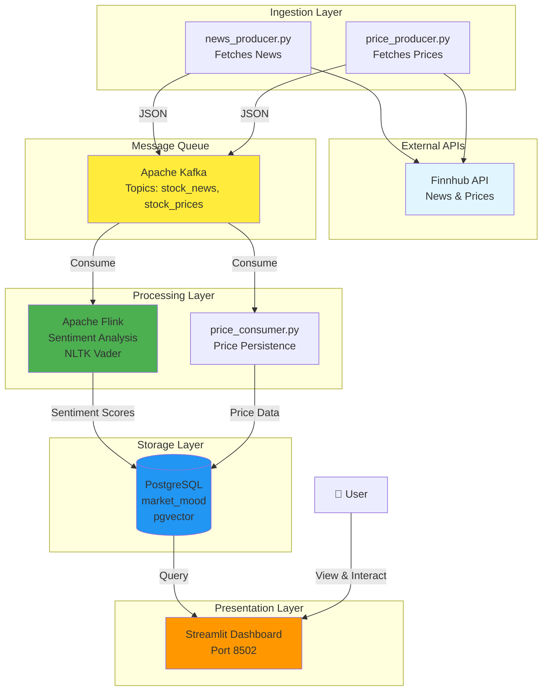
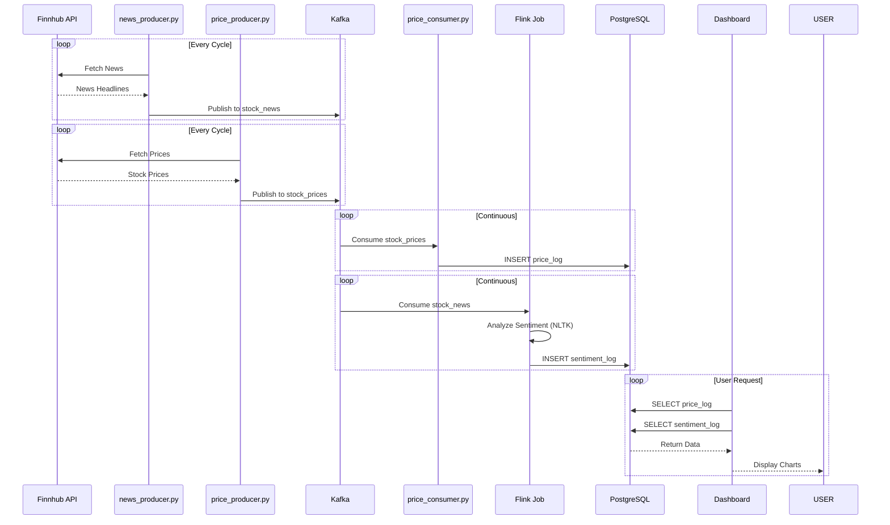

# 🏗️ System Architecture Overview

## High-Level Architecture



---

## Data Flow Diagram

### Phase 1: ETL Pipeline



---

## Component Interaction

### Service Communication

```
┌─────────────────────────────────────────────────────────┐
│                    Docker Network                        │
│                  (market_network)                        │
│                                                          │
│  ┌────────────┐                                         │
│  │ Zookeeper  │◄────────────────┐                      │
│  │   :2181    │                  │                      │
│  └────────────┘                  │                      │
│         ▲                         │                      │
│         │                         │                      │
│  ┌──────┴──────┐          ┌──────▼──────┐             │
│  │    Kafka    │          │   Kafka      │             │
│  │   :29092    │          │   :9092      │             │
│  │  (internal) │          │  (external)  │             │
│  └──────┬──────┘          └─────────────┘             │
│         │                                                │
│    ┌────┴────┐                                          │
│    │         │                                           │
│  ┌─▼──┐   ┌─▼──┐                                        │
│  │NP  │   │PP  │                                        │
│  └─┬──┘   └─┬──┘                                        │
│    │        │                                            │
│    └───┬────┘                                            │
│        │                                                  │
│    ┌───▼────┐                                            │
│    │ Kafka  │                                            │
│    └───┬────┘                                            │
│        │                                                  │
│    ┌───┴────┐                                            │
│    │        │                                            │
│  ┌─▼──┐  ┌─▼────┐                                       │
│  │PC  │  │Flink │                                       │
│  └─┬──┘  └─┬────┘                                       │
│    │       │                                             │
│    └───┬───┘                                             │
│        │                                                 │
│    ┌───▼──────┐                                          │
│    │PostgreSQL│                                          │
│    │  :5432   │                                          │
│    └───┬──────┘                                          │
│        │                                                 │
│    ┌───▼──────┐                                          │
│    │Dashboard │                                          │
│    │  :8502   │                                          │
│    └──────────┘                                          │
└─────────────────────────────────────────────────────────┘
```

---

## Technology Stack

### Infrastructure Layer
- **Container Orchestration:** Docker Compose
- **Message Broker:** Apache Kafka 7.5.0
- **Coordination:** Zookeeper 7.5.0
- **Database:** PostgreSQL 14 with pgvector

### Processing Layer
- **Stream Processing:** Apache Flink 1.17
- **Language:** Python 3.9 (PyFlink)
- **NLP Library:** NLTK Vader Sentiment

### Application Layer
- **UI Framework:** Streamlit
- **Visualization:** Plotly
- **Data Processing:** Pandas

### Data Sources
- **Financial Data:** Finnhub API
- **Stock Coverage:** 30+ US stocks (NYSE, NASDAQ)

---

## Phase Architecture Comparison

### Phase 1: ETL Pipeline (Current)

```
Finnhub → Producers → Kafka → Flink → PostgreSQL → Dashboard
```

**Components:**
- ✅ Data ingestion
- ✅ Stream processing
- ✅ Sentiment analysis
- ✅ Data visualization
- ❌ No LLM/AI
- ❌ No vector embeddings

---

### Phase 2: LLM Integration

```
Finnhub → Producers → Kafka → Flink → PostgreSQL → Dashboard
                              ↓
                         RAG Pipeline → Vector Store → LLM API
```

**Additional Components:**
- ✅ Vector embeddings (sentence-transformers)
- ✅ RAG pipeline
- ✅ LLM integration (cloud API)
- ✅ AI chat interface

---

### Phase 3: Ollama Integration

```
Finnhub → Producers → Kafka → Flink → PostgreSQL → Dashboard
                              ↓
                         RAG Pipeline → Vector Store → Ollama (Local)
```

**Additional Components:**
- ✅ Ollama server (local)
- ✅ Llama 3 model
- ✅ Private, fast AI responses

---

## Scalability Considerations

### Horizontal Scaling

**Kafka:**
- Multiple partitions per topic
- Consumer groups for parallel processing

**Flink:**
- Multiple task managers
- Parallel processing slots

**PostgreSQL:**
- Read replicas
- Connection pooling

### Vertical Scaling

- Increase container resources
- Optimize Flink parallelism
- Database indexing

---

## Security Considerations

### Network Isolation
- Docker bridge network
- Internal service communication only
- External ports only where needed

### Credentials
- Environment variables (.env file)
- Not committed to repository
- Per-service credentials

### Data Privacy
- Phase 1: No external LLM calls
- Phase 3: Local LLM (complete privacy)

---

## Monitoring & Observability

### Flink Dashboard
- Job status and metrics
- Throughput and latency
- Error tracking

### Database Queries
- Query performance
- Table sizes
- Connection counts

### Container Logs
- `docker-compose logs`
- Per-service logging
- Error tracking

---

## Deployment Architecture

### Development
- Local Docker Compose
- Volume mounts for live reloading
- Debug-friendly configuration

### Production (Future)
- Kubernetes deployment
- Service mesh (Istio)
- Monitoring (Prometheus, Grafana)
- Logging (ELK stack)

---

## Summary

The Market Mood Ring architecture follows a modern microservices pattern:

1. **Ingestion:** Python producers fetch data from APIs
2. **Streaming:** Kafka buffers and distributes messages
3. **Processing:** Flink performs real-time transformations
4. **Storage:** PostgreSQL persists processed data
5. **Presentation:** Streamlit provides user interface

Each phase adds capabilities incrementally:
- **Phase 1:** Core ETL pipeline
- **Phase 2:** LLM integration
- **Phase 3:** Local LLM deployment
