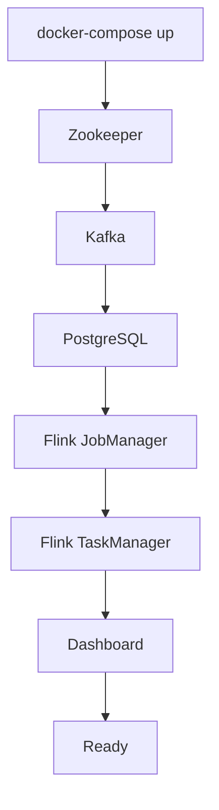

# 🐳 Docker Architecture & Images

## Overview

This document explains the Docker images, containers, and their configurations in the Market Mood Ring project.

---

## 📦 Docker Images

### 1. Base Images (Pulled from Docker Hub)

#### `confluentinc/cp-zookeeper:7.5.0`
- **Purpose:** Coordination service for Kafka
- **Port:** 2181
- **Role:** Manages Kafka broker metadata and coordination
- **Why:** Kafka requires Zookeeper for distributed coordination

#### `confluentinc/cp-kafka:7.5.0`
- **Purpose:** Message broker for streaming data
- **Ports:** 9092 (external), 29092 (internal)
- **Role:** Receives and distributes messages to consumers
- **Topics:** `stock_news`, `stock_prices`
- **Retention:** 24 hours

#### `pgvector/pgvector:pg14`
- **Purpose:** PostgreSQL database with vector extension
- **Port:** 5432
- **Extensions:** pgvector (for Phase 2/3)
- **Database:** `market_mood`
- **Why:** Combines relational data with vector search capabilities

#### `flink:1.17-scala_2.12-java11`
- **Purpose:** Base image for Apache Flink
- **Version:** 1.17 (Scala 2.12, Java 11)
- **Role:** Stream processing framework
- **Customized:** Extended with Python and NLTK support

---

### 2. Custom Images (Built Locally)

#### `market_mood_ring-dashboard`
**Base:** `python:3.9-slim`  
**Dockerfile:** `dashboard/Dockerfile`

**Build Process:**
```dockerfile
FROM python:3.9-slim
WORKDIR /app

# Install system dependencies
RUN apt-get update && \
    apt-get install -y --no-install-recommends \
    gcc postgresql-client && \
    rm -rf /var/lib/apt/lists/*

# Install Python packages
COPY requirements.txt .
RUN pip install --no-cache-dir -r requirements.txt

# Copy application
COPY dashboard/app.py .

# Run Streamlit
CMD ["streamlit", "run", "app.py", "--server.port=8501", "--server.address=0.0.0.0"]
```

**Packages Installed:**
- streamlit (UI framework)
- psycopg2-binary (PostgreSQL driver)
- pandas (data manipulation)
- plotly (charts)

**Volume Mounts:**
- `./dashboard:/app` - Live code reloading

**Port Mapping:**
- Host: 8502 → Container: 8501

---

#### `market_mood_ring-producer`
**Base:** `python:3.9-slim`  
**Dockerfile:** `producer/Dockerfile`

**Build Process:**
```dockerfile
FROM python:3.9-slim
WORKDIR /app

# Install system dependencies
RUN apt-get update && \
    apt-get install -y --no-install-recommends \
    gcc postgresql-client && \
    rm -rf /var/lib/apt/lists/*

# Install Python packages
COPY requirements.txt .
RUN pip install --no-cache-dir -r requirements.txt

# Copy application code
COPY producer/*.py .
```

**Packages Installed:**
- kafka-python (Kafka client)
- psycopg2-binary (PostgreSQL driver)
- requests (HTTP client)
- pandas (data manipulation)

**Volume Mounts:**
- `./producer:/app` - Live code access

**Usage:**
```bash
docker-compose run --rm producer python news_producer.py
docker-compose run --rm producer python price_producer.py
docker-compose run --rm producer python price_consumer.py
```

---

#### `market_mood_ring-jobmanager` & `market_mood_ring-taskmanager`
**Base:** `flink:1.17-scala_2.12-java11`  
**Dockerfile:** `Dockerfile.flink`

**Build Process:**
```dockerfile
FROM flink:1.17-scala_2.12-java11
USER root

# Install Python 3
RUN apt-get update && \
    apt-get install -y python3 python3-pip && \
    apt-get clean && \
    rm -rf /var/lib/apt/lists/*

# Create python symlink (required by Flink)
RUN ln -s /usr/bin/python3 /usr/bin/python

# Install PyFlink and NLTK
RUN pip3 install apache-flink==1.17.0 apache-flink-libraries nltk

# Download Kafka connector JAR
RUN wget -q -O /opt/flink/lib/flink-sql-connector-kafka-1.17.0.jar \
    https://repo1.maven.org/maven2/org/apache/flink/flink-sql-connector-kafka/1.17.0/flink-sql-connector-kafka-1.17.0.jar

# Download JDBC connector JAR
RUN wget -q -O /opt/flink/lib/flink-connector-jdbc-3.1.1-1.17.jar \
    https://repo1.maven.org/maven2/org/apache/flink/flink-connector-jdbc/3.1.1-1.17/flink-connector-jdbc-3.1.1-1.17.jar && \
    wget -q -O /opt/flink/lib/postgresql-42.5.4.jar \
    https://repo1.maven.org/maven2/org/postgresql/postgresql/42.5.4/postgresql-42.5.4.jar

# Set ownership
RUN chown -R flink:flink /opt/flink/lib/

# Download NLTK data
RUN python3 -c "import nltk; nltk.download('vader_lexicon'); nltk.download('punkt')"

# Copy Flink job
COPY flink_jobs/flink_sentiment.py /opt/flink/usrlib/flink_sentiment.py

USER flink
```

**Key Additions:**
1. **Python Support:** Python 3 + pip
2. **Python Symlink:** `python -> python3` (required by Flink)
3. **PyFlink:** Python API for Flink
4. **NLTK:** Natural language processing library
5. **Kafka Connector:** JAR for Kafka integration
6. **JDBC Connector:** JAR for PostgreSQL integration
7. **PostgreSQL Driver:** JDBC driver for database

**JobManager:**
- Port: 8081 (Flink Web UI)
- Command: `jobmanager`
- Role: Coordinates Flink cluster

**TaskManager:**
- Command: `taskmanager`
- Role: Executes Flink jobs
- Scale: 1 (can be scaled horizontally)

---

## 🔗 Container Communication

### Network: `market_network`

All containers communicate via Docker network:

```
┌─────────────────────────────────────────┐
│         market_network (bridge)         │
│                                          │
│  ┌──────────┐      ┌──────────┐        │
│  │ Zookeeper│◄─────┤  Kafka   │        │
│  │  :2181   │      │  :29092  │        │
│  └──────────┘      └────┬─────┘        │
│                          │              │
│  ┌──────────┐      ┌────▼─────┐        │
│  │ Producer │──────┤  Kafka   │        │
│  │          │      │          │        │
│  └──────────┘      └────┬─────┘        │
│                          │              │
│  ┌──────────┐      ┌────▼─────┐        │
│  │  Flink   │──────┤  Kafka   │        │
│  │          │      │          │        │
│  └────┬─────┘      └──────────┘        │
│       │                                  │
│       ▼                                  │
│  ┌──────────┐      ┌──────────┐        │
│  │  Flink   │──────┤PostgreSQL│        │
│  │          │      │  :5432   │        │
│  └──────────┘      └────┬─────┘        │
│                          │              │
│  ┌──────────┐      ┌────▼─────┘        │
│  │ Dashboard│──────┤PostgreSQL│        │
│  │  :8501   │      │          │        │
│  └──────────┘      └──────────┘        │
└─────────────────────────────────────────┘
```

### Service Discovery

Containers resolve each other by service name:
- `kafka:29092` - Kafka broker
- `postgres:5432` - PostgreSQL database
- `zookeeper:2181` - Zookeeper
- `jobmanager:8081` - Flink JobManager

---

## 💾 Volume Management

### Named Volumes

```yaml
volumes:
  postgres_data:    # PostgreSQL data persistence
  ollama_data:      # Ollama model storage (Phase 3)
```

**Purpose:**
- Data persists across container restarts
- Not deleted with `docker-compose down`
- Use `docker-compose down -v` to remove

### Bind Mounts

```yaml
volumes:
  - ./dashboard:/app          # Dashboard code
  - ./producer:/app           # Producer code
  - ./flink_jobs:/opt/flink/usrlib  # Flink jobs
  - ./init.sql:/docker-entrypoint-initdb.d/init.sql  # DB init
```

**Purpose:**
- Live code reloading (no rebuild needed)
- Development convenience
- Database initialization

---

## 🔧 Environment Variables

### Producer Container

```yaml
environment:
  - FINNHUB_API_KEY=${FINNHUB_API_KEY}
  - STOCK_SYMBOLS=${STOCK_SYMBOLS:-}
  - KAFKA_BOOTSTRAP_SERVERS=kafka:29092
  - POSTGRES_HOST=postgres
  - POSTGRES_DB=market_mood
  - POSTGRES_USER=market_user
  - POSTGRES_PASSWORD=market_password
```

### Dashboard Container

```yaml
environment:
  - POSTGRES_HOST=postgres
  - POSTGRES_DB=market_mood
  - POSTGRES_USER=market_user
  - POSTGRES_PASSWORD=market_password
```

### PostgreSQL Container

```yaml
environment:
  POSTGRES_USER: market_user
  POSTGRES_PASSWORD: market_password
  POSTGRES_DB: market_mood
```

---

## 📊 Container Lifecycle

### Startup Order



### Dependencies

```yaml
kafka:
  depends_on:
    - zookeeper

flink:
  depends_on:
    - kafka
    - postgres

dashboard:
  depends_on:
    - postgres

producer:
  depends_on:
    - kafka
    - postgres
```

---

## 🚀 Build Process

### Image Building

```bash
# Build all images
docker-compose build

# Build specific service
docker-compose build dashboard

# Build without cache
docker-compose build --no-cache
```

### Build Context

- **Dashboard:** Root directory (`.`) - Accesses `requirements.txt`
- **Producer:** Root directory (`.`) - Accesses `requirements.txt`
- **Flink:** Root directory (`.`) - Accesses `Dockerfile.flink` and `flink_jobs/`

---

## 🔍 Container Inspection

### View Running Containers

```bash
docker-compose ps
```

### View Logs

```bash
# All services
docker-compose logs

# Specific service
docker-compose logs kafka
docker-compose logs dashboard
```

### Execute Commands

```bash
# Inside container
docker exec -it market_postgres psql -U market_user -d market_mood

# Run one-off command
docker-compose run --rm producer python news_producer.py
```

---

## 📝 Summary

| Image | Base | Purpose | Port |
|-------|------|---------|------|
| Zookeeper | confluentinc/cp-zookeeper | Kafka coordination | 2181 |
| Kafka | confluentinc/cp-kafka | Message broker | 9092/29092 |
| PostgreSQL | pgvector/pgvector | Database | 5432 |
| Dashboard | python:3.9-slim | Streamlit UI | 8502 |
| Producer | python:3.9-slim | Data ingestion | - |
| Flink | flink:1.17 | Stream processing | 8081 |

All containers communicate via `market_network` using service names for DNS resolution.
