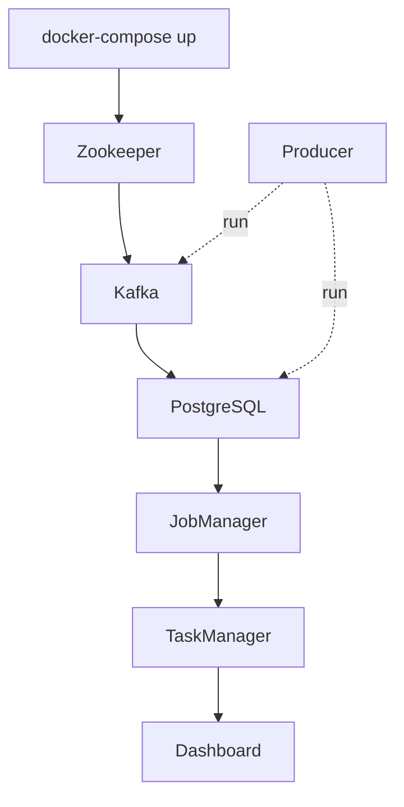

# 🐙 Docker Compose Architecture

## Overview

This document provides a comprehensive explanation of the `docker-compose.yaml` file, its services, networking, volumes, and orchestration.

---

## 📋 File Structure

```yaml
services:
  zookeeper:      # Kafka coordination
  kafka:          # Message broker
  postgres:       # Database
  jobmanager:     # Flink coordinator
  taskmanager:    # Flink worker
  dashboard:      # Streamlit UI
  producer:       # Data ingestion (profile)
  # ollama:       # LLM server (Phase 3, commented)

networks:
  market_network: # Bridge network

volumes:
  postgres_data:  # Database persistence
  ollama_data:    # Model storage (Phase 3)
```

---

## 🏗️ Service Architecture

### 1. Zookeeper Service

```yaml
zookeeper:
  image: confluentinc/cp-zookeeper:7.5.0
  container_name: market_zookeeper
  environment:
    ZOOKEEPER_CLIENT_PORT: 2181
    ZOOKEEPER_TICK_TIME: 2000
  networks:
    - market_network
```

**Purpose:**
- Coordinates Kafka brokers
- Manages cluster metadata
- Required for Kafka operation

**Configuration:**
- `ZOOKEEPER_CLIENT_PORT`: Client connection port
- `ZOOKEEPER_TICK_TIME`: Heartbeat interval (ms)

**Dependencies:** None (starts first)

---

### 2. Kafka Service

```yaml
kafka:
  image: confluentinc/cp-kafka:7.5.0
  container_name: market_kafka
  depends_on:
    - zookeeper
  ports:
    - "9092:9092"
  environment:
    KAFKA_BROKER_ID: 1
    KAFKA_ZOOKEEPER_CONNECT: zookeeper:2181
    KAFKA_ADVERTISED_LISTENERS: PLAINTEXT://kafka:29092,PLAINTEXT_HOST://localhost:9092
    KAFKA_LISTENER_SECURITY_PROTOCOL_MAP: PLAINTEXT:PLAINTEXT,PLAINTEXT_HOST:PLAINTEXT
    KAFKA_INTER_BROKER_LISTENER_NAME: PLAINTEXT
    KAFKA_OFFSETS_TOPIC_REPLICATION_FACTOR: 1
    KAFKA_AUTO_CREATE_TOPICS_ENABLE: 'true'
    KAFKA_LOG_RETENTION_HOURS: 24
    KAFKA_LOG_RETENTION_BYTES: 1073741824
```

**Purpose:**
- Message broker for streaming data
- Receives messages from producers
- Distributes to consumers

**Port Configuration:**
- `9092`: External access (host → container)
- `29092`: Internal access (container → container)

**Listener Configuration:**
- `PLAINTEXT://kafka:29092`: Internal network
- `PLAINTEXT_HOST://localhost:9092`: External access

**Topic Settings:**
- `AUTO_CREATE_TOPICS_ENABLE`: Creates topics automatically
- `LOG_RETENTION_HOURS`: 24 hours retention
- `LOG_RETENTION_BYTES`: 1GB max size

**Dependencies:** `zookeeper`

---

### 3. PostgreSQL Service

```yaml
postgres:
  image: pgvector/pgvector:pg14
  container_name: market_postgres
  environment:
    POSTGRES_USER: market_user
    POSTGRES_PASSWORD: market_password
    POSTGRES_DB: market_mood
  ports:
    - "5432:5432"
  volumes:
    - ./init.sql:/docker-entrypoint-initdb.d/init.sql
    - postgres_data:/var/lib/postgresql/data
```

**Purpose:**
- Relational database
- Vector storage (pgvector extension)
- Data persistence

**Initialization:**
- `init.sql` mounted to `/docker-entrypoint-initdb.d/`
- Executes automatically on first start
- Creates tables and extensions

**Volume:**
- `postgres_data`: Named volume for persistence
- Data survives container restarts

**Dependencies:** None

---

### 4. Flink JobManager

```yaml
jobmanager:
  build:
    context: .
    dockerfile: Dockerfile.flink
  container_name: market_jobmanager
  command: jobmanager
  ports:
    - "8081:8081"
  environment:
    - |
      FLINK_PROPERTIES=
      jobmanager.rpc.address: jobmanager
      taskmanager.numberOfTaskSlots: 2
      parallelism.default: 1
  volumes:
    - ./flink_jobs:/opt/flink/usrlib
  networks:
    - market_network
  depends_on:
    - kafka
    - postgres
```

**Purpose:**
- Coordinates Flink cluster
- Manages job submission
- Web UI at port 8081

**Configuration:**
- `jobmanager.rpc.address`: RPC address
- `taskmanager.numberOfTaskSlots`: Slots per task manager
- `parallelism.default`: Default parallelism

**Volume:**
- `./flink_jobs:/opt/flink/usrlib`: Job files

**Dependencies:** `kafka`, `postgres`

---

### 5. Flink TaskManager

```yaml
taskmanager:
  build:
    context: .
    dockerfile: Dockerfile.flink
  container_name: market_taskmanager
  command: taskmanager
  scale: 1
  environment:
    - |
      FLINK_PROPERTIES=
      jobmanager.rpc.address: jobmanager
      taskmanager.numberOfTaskSlots: 2
```

**Purpose:**
- Executes Flink jobs
- Processes data streams
- Can be scaled horizontally

**Scaling:**
```bash
docker-compose up -d --scale taskmanager=3
```

**Dependencies:** `jobmanager` (implicit)

---

### 6. Dashboard Service

```yaml
dashboard:
  build:
    context: .
    dockerfile: ./dashboard/Dockerfile
  container_name: market_dashboard
  ports:
    - "8502:8501"
  environment:
    - POSTGRES_HOST=postgres
    - POSTGRES_DB=market_mood
    - POSTGRES_USER=market_user
    - POSTGRES_PASSWORD=market_password
  volumes:
    - ./dashboard:/app
  networks:
    - market_network
  depends_on:
    - postgres
```

**Purpose:**
- Streamlit web application
- User interface
- Data visualization

**Port Mapping:**
- Host `8502` → Container `8501`
- Changed from 8501 to avoid conflicts

**Volume:**
- `./dashboard:/app`: Live code reloading

**Dependencies:** `postgres`

---

### 7. Producer Service

```yaml
producer:
  build:
    context: .
    dockerfile: ./producer/Dockerfile
  container_name: market_producer
  environment:
    - FINNHUB_API_KEY=${FINNHUB_API_KEY}
    - STOCK_SYMBOLS=${STOCK_SYMBOLS:-}
    - KAFKA_BOOTSTRAP_SERVERS=kafka:29092
    - POSTGRES_HOST=postgres
    - POSTGRES_DB=market_mood
    - POSTGRES_USER=market_user
    - POSTGRES_PASSWORD=market_password
  volumes:
    - ./producer:/app
  networks:
    - market_network
  depends_on:
    - kafka
    - postgres
  profiles:
    - producers
```

**Purpose:**
- Data ingestion scripts
- Not started automatically
- Run on-demand

**Profiles:**
- `profiles: producers`: Excluded from default `up`
- Use `docker-compose run` to execute

**Usage:**
```bash
docker-compose run --rm producer python news_producer.py
docker-compose run --rm producer python price_producer.py
docker-compose run --rm producer python price_consumer.py
```

**Dependencies:** `kafka`, `postgres`

---

## 🌐 Network Configuration

### Market Network

```yaml
networks:
  market_network:
    driver: bridge
```

**Type:** Bridge network  
**Purpose:** Isolated network for all services  
**DNS:** Service names resolve to container IPs

**Service Discovery:**
- `kafka` → `172.22.0.X`
- `postgres` → `172.22.0.Y`
- `zookeeper` → `172.22.0.Z`

---

## 💾 Volume Configuration

### Named Volumes

```yaml
volumes:
  postgres_data:
  ollama_data:
```

**Purpose:**
- Data persistence
- Survives container removal
- Managed by Docker

**Removal:**
```bash
docker-compose down -v  # Removes volumes
```

### Bind Mounts

```yaml
volumes:
  - ./dashboard:/app
  - ./producer:/app
  - ./flink_jobs:/opt/flink/usrlib
  - ./init.sql:/docker-entrypoint-initdb.d/init.sql
```

**Purpose:**
- Development convenience
- Live code reloading
- Configuration files

---

## 🔄 Startup Sequence



**Automatic Startup:**
1. Zookeeper
2. Kafka (waits for Zookeeper)
3. PostgreSQL
4. Flink JobManager (waits for Kafka, PostgreSQL)
5. Flink TaskManager (waits for JobManager)
6. Dashboard (waits for PostgreSQL)

**Manual Startup:**
- Producer: `docker-compose run --rm producer`

---

## 🎯 Profiles Feature

### Purpose

Selectively start services:

```bash
# Start all services (default)
docker-compose up -d

# Start with specific profile
docker-compose --profile producers up -d

# Producer has profile, so excluded from default up
```

### Producer Profile

```yaml
profiles:
  - producers
```

**Effect:**
- Not started with `docker-compose up`
- Started with `docker-compose --profile producers up`
- Always available via `docker-compose run`

---

## 🔧 Environment Variables

### From `.env` File

```bash
FINNHUB_API_KEY=your_key
STOCK_SYMBOLS=AAPL,MSFT,TSLA
```

**Usage:**
```yaml
environment:
  - FINNHUB_API_KEY=${FINNHUB_API_KEY}
  - STOCK_SYMBOLS=${STOCK_SYMBOLS:-}
```

**Syntax:**
- `${VAR}`: Required variable
- `${VAR:-}`: Optional variable (empty if not set)

---

## 📊 Service Dependencies Graph

```
Zookeeper (no deps)
    ↓
Kafka (depends on Zookeeper)
    ↓
PostgreSQL (no deps)
    ↓
JobManager (depends on Kafka, PostgreSQL)
    ↓
TaskManager (depends on JobManager)
    ↓
Dashboard (depends on PostgreSQL)

Producer (depends on Kafka, PostgreSQL) - Manual run
```

---

## 🚀 Common Commands

### Start Services

```bash
# Start all services
docker-compose up -d

# Start with build
docker-compose up -d --build

# Start specific service
docker-compose up -d postgres
```

### Stop Services

```bash
# Stop all services
docker-compose down

# Stop and remove volumes
docker-compose down -v

# Stop specific service
docker-compose stop kafka
```

### View Status

```bash
# List services
docker-compose ps

# View logs
docker-compose logs -f kafka

# View logs for all
docker-compose logs -f
```

### Run Commands

```bash
# Run producer script
docker-compose run --rm producer python news_producer.py

# Execute command in running container
docker exec -it market_postgres psql -U market_user -d market_mood
```

---

## 📝 Summary

| Service | Image | Port | Auto-Start | Profile |
|---------|-------|------|------------|---------|
| Zookeeper | confluentinc/cp-zookeeper | 2181 | ✅ | - |
| Kafka | confluentinc/cp-kafka | 9092 | ✅ | - |
| PostgreSQL | pgvector/pgvector | 5432 | ✅ | - |
| JobManager | Custom (Flink) | 8081 | ✅ | - |
| TaskManager | Custom (Flink) | - | ✅ | - |
| Dashboard | Custom (Python) | 8502 | ✅ | - |
| Producer | Custom (Python) | - | ❌ | producers |

All services communicate via `market_network` bridge network.
