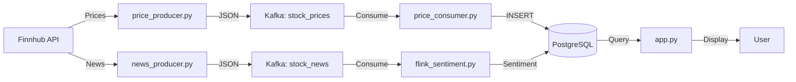

# 🐍 Python Files Architecture & Functionality

## Overview

This document provides a comprehensive explanation of all Python files in the Market Mood Ring project, their functions, data flow, and application.

---

## 📁 File Structure

```
Market_Mood_Ring/
├── producer/
│   ├── news_producer.py      # News ingestion
│   ├── price_producer.py      # Price ingestion
│   ├── price_consumer.py       # Price persistence
│   └── rag_ingest.py          # Vector embeddings (Phase 2)
├── flink_jobs/
│   └── flink_sentiment.py     # Stream processing
└── dashboard/
    └── app.py                  # Streamlit UI
```

---

## 🔄 Data Flow Architecture



---

## 📰 Producer Files

### 1. `producer/news_producer.py`

**Purpose:** Fetches stock news headlines from Finnhub API and publishes to Kafka.

**Function:**
- Connects to Finnhub API
- Fetches news for configured stock symbols
- Publishes JSON messages to Kafka `stock_news` topic

**Key Components:**

```python
# Ticker Loading (Priority Order)
1. STOCK_SYMBOLS environment variable
2. producer/tickers.json file
3. Default hardcoded list (30 tickers)

# Rate Limiting
- Calculates sleep time based on number of symbols
- Respects Finnhub Free Tier (60 calls/minute)
- Formula: sleep_time = max(1, len(symbols) / 60)
```

**Data Format Published to Kafka:**
```json
{
    "symbol": "AAPL",
    "headline": "Apple announces new product",
    "summary": "Full article summary...",
    "ts": 1234567890.0
}
```

**Configuration:**
- `FINNHUB_API_KEY`: Required (from .env)
- `KAFKA_BOOTSTRAP_SERVERS`: Default `kafka:29092`
- `STOCK_SYMBOLS`: Optional override

**Application:**
- Runs continuously in a loop
- Fetches news every cycle (rate-limited)
- Publishes to Kafka for downstream processing

---

### 2. `producer/price_producer.py`

**Purpose:** Fetches real-time stock prices from Finnhub API and publishes to Kafka.

**Function:**
- Connects to Finnhub API
- Fetches current prices for configured symbols
- Publishes JSON messages to Kafka `stock_prices` topic

**Key Components:**

```python
# Same ticker loading logic as news_producer.py
# Fetches quote data (price, high, low, open, previous_close)
# Publishes price updates continuously
```

**Data Format Published to Kafka:**
```json
{
    "symbol": "AAPL",
    "price": 150.25,
    "high": 152.00,
    "low": 149.50,
    "open": 151.00,
    "previous_close": 150.00,
    "timestamp": "2026-02-06T12:00:00"
}
```

**Application:**
- Runs continuously
- Updates prices every few seconds
- Provides real-time price data for dashboard

---

### 3. `producer/price_consumer.py`

**Purpose:** Consumes price data from Kafka and writes to PostgreSQL.

**Function:**
- Consumes messages from `stock_prices` Kafka topic
- Extracts symbol and price
- Inserts into PostgreSQL `price_log` table

**Key Components:**

```python
# Kafka Consumer
- Topic: stock_prices
- Auto-offset: latest (reads new messages only)
- Deserializer: JSON

# PostgreSQL Connection
- Database: market_mood
- Table: price_log
- Columns: symbol, price, timestamp
```

**Data Flow:**
```
Kafka (stock_prices) → Consumer → PostgreSQL (price_log)
```

**Application:**
- Bridge between Kafka and PostgreSQL
- Enables dashboard to query price history
- Runs continuously, processing messages as they arrive

---

### 4. `producer/rag_ingest.py` (Phase 2)

**Purpose:** Creates vector embeddings for news and stores in PostgreSQL.

**Function:**
- Consumes news from Kafka `stock_news` topic
- Generates embeddings using sentence-transformers
- Stores embeddings in `financial_knowledge` table

**Key Components:**

```python
# Embedding Model
- Model: all-MiniLM-L6-v2 (384 dimensions)
- Fast and efficient for real-time processing

# Vector Storage
- PostgreSQL with pgvector extension
- Enables semantic search for RAG pipeline
```

**Data Format:**
```python
{
    "symbol": "AAPL",
    "content": "AAPL Headline: ... Summary: ...",
    "embedding": [0.123, -0.456, ...]  # 384-dim vector
}
```

**Application:**
- Phase 2: RAG pipeline preparation
- Enables semantic search over financial news
- Required for AI Analyst functionality

---

## ⚡ Flink Job

### 5. `flink_jobs/flink_sentiment.py`

**Purpose:** Stream processing job that analyzes sentiment of news headlines.

**Function:**
- Reads news from Kafka `stock_news` topic
- Applies NLTK Vader sentiment analysis
- Writes sentiment scores to PostgreSQL

**Architecture:**

```python
# 1. User Defined Function (UDF)
@udf(result_type=DataTypes.FLOAT())
def analyze_sentiment(headline: str):
    # Runs inside Flink cluster
    sia = SentimentIntensityAnalyzer()
    score = sia.polarity_scores(headline)
    return score['compound']  # -1.0 to +1.0

# 2. Source Table (Kafka)
CREATE TABLE news_source (
    symbol STRING,
    headline STRING,
    summary STRING,
    ts DOUBLE
) WITH (
    'connector' = 'kafka',
    'topic' = 'stock_news',
    ...
)

# 3. Sink Table (PostgreSQL)
CREATE TABLE sentiment_sink (
    symbol STRING,
    headline STRING,
    sentiment_score FLOAT
) WITH (
    'connector' = 'jdbc',
    ...
)

# 4. Processing Query
INSERT INTO sentiment_sink
SELECT symbol, headline, get_sentiment(headline)
FROM news_source
```

**Processing Flow:**
```
Kafka (stock_news) → Flink → NLTK Vader → PostgreSQL (sentiment_log)
```

**Sentiment Scores:**
- **Positive:** > 0.1 (🟢)
- **Neutral:** -0.1 to 0.1 (🟡)
- **Negative:** < -0.1 (🔴)

**Application:**
- Real-time sentiment analysis
- Processes news as it arrives
- Enables sentiment-based market analysis

---

## 🎨 Dashboard

### 6. `dashboard/app.py`

**Purpose:** Streamlit web application for visualizing market data and AI chat.

**Function:**
- Displays real-time price charts
- Shows sentiment scores
- Provides AI chat interface (Phase 2/3)

**Key Components:**

```python
# 1. Database Connection (Cached)
@st.cache_resource
def get_db_connection():
    # Connects to PostgreSQL
    # Returns connection object

# 2. Price Chart Query
SELECT symbol, price, timestamp 
FROM price_log 
WHERE timestamp > NOW() - INTERVAL '24 hours'
ORDER BY timestamp DESC
LIMIT 1000

# 3. Sentiment Query
SELECT symbol, headline, sentiment_score
FROM sentiment_log 
ORDER BY created_at DESC
LIMIT 20

# 4. AI Chat (Phase 2/3)
- Vector search over financial_knowledge
- Context retrieval
- LLM generation (Ollama or Cloud API)
```

**Pages:**
1. **Live Dashboard** (Phase 1)
   - Price charts
   - Sentiment tables
   
2. **AI Analyst** (Phase 2/3)
   - Chat interface
   - Context-aware responses

**Application:**
- User-facing interface
- Real-time data visualization
- Interactive market analysis

---

## 🔗 Integration Points

### Kafka Topics

| Topic | Producer | Consumer | Purpose |
|-------|----------|----------|---------|
| `stock_news` | `news_producer.py` | `flink_sentiment.py`, `rag_ingest.py` | News headlines |
| `stock_prices` | `price_producer.py` | `price_consumer.py` | Price updates |

### PostgreSQL Tables

| Table | Writer | Reader | Purpose |
|-------|--------|--------|---------|
| `price_log` | `price_consumer.py` | `app.py` | Price history |
| `sentiment_log` | `flink_sentiment.py` | `app.py` | Sentiment scores |
| `financial_knowledge` | `rag_ingest.py` | `app.py` | Vector embeddings (Phase 2) |

---

## 🚀 Execution Model

### Continuous Processes

These run indefinitely:
- `news_producer.py` - Fetches news continuously
- `price_producer.py` - Fetches prices continuously
- `price_consumer.py` - Consumes prices continuously
- `rag_ingest.py` - Processes embeddings continuously (Phase 2)
- `flink_sentiment.py` - Stream processing job (submitted once, runs continuously)

### Interactive Process

- `app.py` - Streamlit server (runs continuously, user interacts via browser)

---

## 📊 Performance Considerations

### Rate Limiting
- News producer: Auto-adjusts based on symbol count
- Price producer: Can fetch all symbols simultaneously (WebSocket)

### Scalability
- Kafka: Handles high throughput
- Flink: Parallel processing across task managers
- PostgreSQL: Indexed queries for fast retrieval

### Resource Usage
- News producer: Low (API calls)
- Price producer: Low (API calls)
- Flink job: Medium (NLTK processing)
- RAG ingest: High (embedding generation)

---

## 🔧 Configuration

All Python files use environment variables for configuration:

```bash
# Required
FINNHUB_API_KEY=your_key

# Optional
STOCK_SYMBOLS=AAPL,MSFT,TSLA
KAFKA_BOOTSTRAP_SERVERS=kafka:29092
POSTGRES_HOST=postgres
POSTGRES_DB=market_mood
POSTGRES_USER=market_user
POSTGRES_PASSWORD=market_password
```

---

## 📝 Summary

| File | Type | Phase | Purpose |
|------|------|-------|---------|
| `news_producer.py` | Producer | 1 | Fetch news → Kafka |
| `price_producer.py` | Producer | 1 | Fetch prices → Kafka |
| `price_consumer.py` | Consumer | 1 | Kafka → PostgreSQL |
| `flink_sentiment.py` | Processor | 1 | Kafka → Sentiment → PostgreSQL |
| `rag_ingest.py` | Processor | 2 | Kafka → Embeddings → PostgreSQL |
| `app.py` | UI | 1-3 | PostgreSQL → Dashboard |
